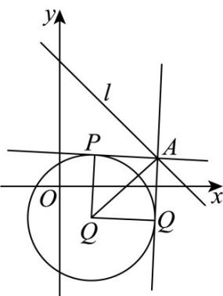

> [!faq]- 《专题04_直线与圆_圆与圆的位置关系的四大常考题型_高效培优专项训练_》官方解析
>
> > [!success]- **【答案】** D
>
> > [!note]- **【解析】**
> > 因为圆 $C:(x-1)^{2}+(y-m)^{2}=4$ 的半径为 2，
> >
> > 且过直线 l 上任意一点 A 都能作圆 C 的两条切线，切点为 P, Q，且 $\angle PAQ < \frac{\pi}{3}$ ,
> >
> > 所以圆心 $\left(1, m\right)$ 到直线 $l$ 的距离 $d = \frac{|m - 3|}{\sqrt{2}} > \frac{2}{\sin \frac{\pi}{6}} = 4$ ，解得 $m < 3 - 4\sqrt{2}$ 或 $m > 3 + 4\sqrt{2}$ ，
> >
> > 
> >
> > 故实数 m 的取值范围是 $\left(-\infty,3-4\sqrt{2}\right)\cup\left(3+4\sqrt{2},+\infty\right)$ .
> >
> > 故选 **D**
