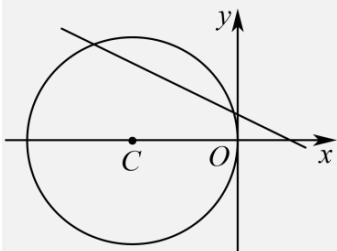

> [!faq]- 《专题04_直线与圆_圆与圆的位置关系的四大常考题型_高效培优专项训练_》官方解析
>
> > [!success]- **【答案】** CD
>
> > [!note]- **【解析】**
> > 对于 A 项，整理直线 $l:(m+1)x+2y-1+m=0(m\in\mathbf{R})$
> >
> > 可得出 $m(x + 1) + x + 2y - 1 = 0$
> >
> > 解方程组 $\left\{ \begin{array}{l}x + 1 = 0\\ x + 2y - 1 = 0 \end{array} \right.$ 可得，直线 $l$ 过定点 $A(-1,1)$
> >
> > 圆 $C:(x + 2)^{2} + y^{2} = 4$ 的圆心为 $C(-2,0)$ ，半径为 $r = 2$
> >
> > 则 $|AC| = \sqrt{(-2 + 1)^2 + (0 - 1)^2} = \sqrt{2} < 2$
> >
> > 所以点 A 在圆内，即直线 l 过圆内一定点，
> >
> > 所以，直线 l 与圆 C 一定相交·故 A 错误；
> >
> > 
> >
> > 对于 B 项，当 m=0 时，直线 l 化为 $x+2y-1=0$ .
> >
> > 此时有圆心 $C(-2,0)$ 到直线 $l$ 的距离 $d = \frac{|-2\times 1 - 1|}{\sqrt{1^2 + 2^2}} = \frac{3\sqrt{5}}{5}$ ，且 $1 < d < 2$ ，
> >
> > 因此圆 C 上只有两个点到直线 l 的距离等于 $^{1}$ ·故 B 错误；
> >
> > 对于 $C$ 项，因为 $(m + 1)\times 2 - 2(m + 1) = 0$
> >
> > 所以直线 l 与直线 $2x - (m + 1)y = 0$ 垂直·故 C 正确；
> >
> > 对于 D 项，要使圆 C 与圆 $x^{2} + y^{2} - 2x + 8y + a = 0$ 恰有三条公切线，则应满足两圆外切.
> >
> > 圆 $x^{2} + y^{2} - 2x + 8y + a = 0$ 可化为 $(x - 1)^{2} + (y + 4)^{2} = 17 - a$ （ $a <   17$ ）
> >
> > 圆心为 $M(1,-4)$ ，半径为 $R=\sqrt{17-a}$
> >
> > 因为两圆外切，所以有 $|MC| = r + R$
> >
> > 即 $\sqrt{17-a}+2=\sqrt{(-2-1)^{2}+(0+4)^{2}}=5$
> >
> > 整理可得 $\sqrt{17-a}=3$ ，化简可得 17-a=9，
> >
> > 解得 $a = 8$ ·故D项正确·
> >
> > 故选 **CD**.
