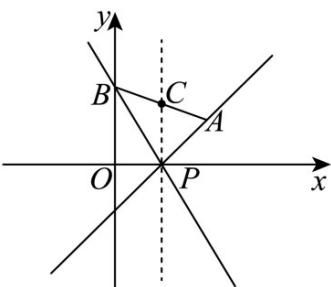

> [!faq]- 《专题01 直线的倾斜角、斜率及方程的四大常考题型（高效培优专项训练）》官方解析
>
> > [!success]- **【答案】** $$ \left[ \frac {\pi}{4}, \frac {2 \pi}{3} \right] $$ $$ \left(- \infty , - \sqrt {3} \right] \cup [ 1, + \infty) $$
>
> > [!note]- **【解析】**
> > 解法一：由题意， $k_{AP}=\frac{1-0}{2-1}=1$ ， $k_{BP}=\frac{\sqrt{3}-0}{0-1}=-\sqrt{3}$
> >
> > 设直线 $PA$ ， $PB$ 的倾斜角分别为 $\alpha$ ， $\beta$ ，则 $\alpha = \frac{\pi}{4}$ ， $\beta = \frac{2\pi}{3}$
> >
> > 如图所示，过点 P 作 x 轴的垂线，与线段 AB 交点于 C，
> >
> > 当直线 $l$ 由 $PA$ 变化到 $PC$ 的位置时，直线 $l$ 的倾斜角由 $\frac{\pi}{4}$ 增到 $\frac{\pi}{2}$ ，其斜率的范围为 $[1, +\infty)$ ；当直线 $l$ 由 $PC$ 变化到 $PB$ 的位置时，直线 $l$ 的倾斜角由 $\frac{\pi}{2}$ 增到 $\frac{2\pi}{3}$ ，其斜率的范围为 $[- \infty, -\sqrt{3})$ 。
> >
> > 故直线 $l$ 倾斜角的取值范围为 $\left[\frac{\pi}{4},\frac{2\pi}{3}\right]$ ，其斜率的取值范围为 $\left(-\infty , - \sqrt{3}\right]\cup \left[1, + \infty\right)$
> >
> > 
> >
> > 故答案为： $\left[\frac{\pi}{4},\frac{2\pi}{3}\right]$ ； $(-\infty , - \sqrt{3} ]\cup [1, + \infty)$
> >
> > 解法二：设直线 $l$ 的斜率为 $k$ ，则直线 $l$ 的方程为 $y = k(x - 1)$ ，即 $kx - y - k = 0$
> >
> > 由题意，点 A，B 在直线 l 的两侧或其中一点在直线 l 上，
> >
> > 所以 $\left(2k - 1 - k\right)\left(-\sqrt{3} - k\right) \leq 0$ ，即 $\left(k - 1\right)\left(k + \sqrt{3}\right) = 0$ ，解得 $k - 1$ 或 $k \leq -\sqrt{3}$
> >
> > 故直线 $l$ 的斜率的取值范围为 $\left(-\infty, -\sqrt{3}\right] \cup [1, +\infty)$
> >
> > 所以其倾斜角的取值范围为 $\left[\frac{\pi}{4},\frac{2\pi}{3}\right]$
> >
> > 故答案为： $\left[\frac{\pi}{4},\frac{2\pi}{3}\right]$ ； $(-\infty , - \sqrt{3} ]\cup [1, + \infty)$
