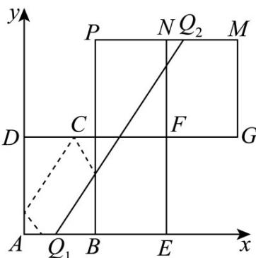

> [!faq]- 《专题01 直线的倾斜角、斜率及方程的四大常考题型（高效培优专项训练）》官方解析
>
> > [!success]- **【答案】** $\left(\frac{\sqrt{3}}{2},\frac{3}{2}\sqrt{3}\right)$
>
> > [!note]- **【解析】**
> > 如图所示，质点由 $Q_{1}$ 出发依次经 BC，CD，DA 反射后到达线段 AB，相当于直线 $Q_{1}Q_{2}$ 与线段 MN 相交，则 $k_{AM} < k_{Q_{1}Q_{2}} < k_{BN}$
> >
> > 又因为 $M(3a,2b), N(2a,2b)$ ，且 $k_{Q_1Q_2} = \tan 60^\circ = \sqrt{3}$
> >
> > 即 $\frac{2b}{2a} < \sqrt{3} < \frac{2b}{a}$ ，所以 $\frac{\sqrt{3}}{2} < \frac{b}{a} < \frac{3}{2}\sqrt{3}$
> >
> > 故答案为： $\left(\frac{\sqrt{3}}{2},\frac{3\sqrt{3}}{2}\right)$
> >
> > 
