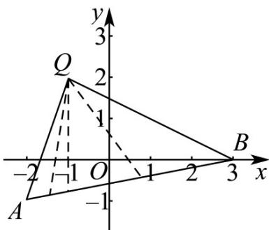
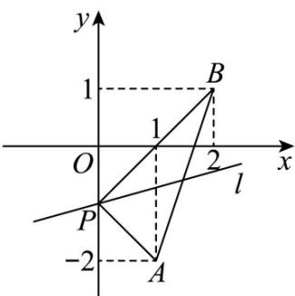

> [!faq]- 《专题01 直线的倾斜角、斜率及方程的四大常考题型（高效培优专项训练）》官方解析
>
> > [!success]- **【答案】** A. $\left(-\infty, -\frac{1}{2}\right] \cup [3, +\infty)$ B. $\left[-\frac{1}{2}, 3\right]$ C. $(- \infty, -1] \cup [3, +\infty)$ D. $[-1, 3]$
>
> > [!note]- **【解析】**
> > 设 $Q(-1,2)$ ，则 $k_{QA} = \frac{2 - (-1)}{-1 - (-2)} = 3$ ， $k_{QB} = \frac{2 - 0}{-1 - 3} = -\frac{1}{2}$ 因为点 $M(x,y)$ 在线段 $AB$ 上，所以 $\frac{y - 2}{x + 1}$ 的取值范围是 $\left(-\infty , - \frac{1}{2}\right]\cup [3, + \infty)$
> >
> > 故选：A.
> >
> > 
> >
> > 14. 经过点 $P(0, -1)$ 作直线 $l$ ，若直线 $l$ 与连接 $A(1, -2)$ ， $B(2, 1)$ 两点的线段总有公共点，则直线 $l$ 的倾斜角的取值范围是（）
> >
> > 【答案】
> > A. $\left[-\frac{\pi}{4}, \frac{\pi}{4}\right]$ B. $\left[0, \frac{\pi}{4}\right]$ C. $\left[\frac{\pi}{4}, \frac{3\pi}{4}\right]$ D. $\left[0, \frac{\pi}{4}\right] \cup \left[\frac{3\pi}{4}, \pi\right)$
> >
> > 【答案】D
> >
> > 【详解】解：设直线 $l$ 的斜率为 $k$ ，直线 $l$ 的倾斜角为 $\alpha$ ，则 $0 \leq \alpha < \pi$
> >
> > 因为直线 $PA$ 的斜率为 $\frac{-1 - (-2)}{0 - 1} = -1$ ，直线 $PB$ 的斜率为 $\frac{-1 - 1}{0 - 2} = 1$
> >
> > 因为直线 l 经过点 $P(0,-1)$ ，且与线段 AB 总有公共点，
> >
> > 所以 $-1 \leq k \leq 1$ ，即 $-1 \leq \tan \alpha \leq 1$
> >
> > 因为 $0 \leq \alpha < \pi$
> >
> > 所以 $0 \leq \alpha \leq \frac{\pi}{4}$ 或 $\frac{3\pi}{4} \leq \alpha < \pi$
> >
> > 故直线 $l$ 的倾斜角的取值范围是 $\left[0, \frac{\pi}{4}\right] \cup \left[\frac{3\pi}{4}, \pi\right)$
> >
> > 故选：D.
> >
> > 
