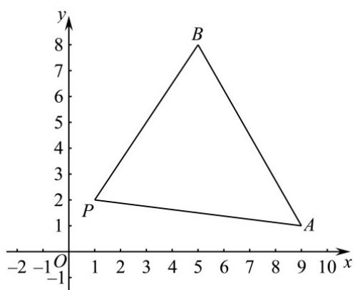

> [!faq]- 《专题01 直线的倾斜角、斜率及方程的四大常考题型（高效培优专项训练）》官方解析
>
> > [!success]- **【答案】** A. $\left[\frac{1}{8}, \frac{3}{2}\right]$ B. $\left(-\infty, -\frac{1}{8}\right)$ C. $\left[-\frac{1}{8}, \frac{3}{2}\right]$ D. $\left(-\infty, -\frac{1}{8}\right] \cup \left[\frac{3}{2}, +\infty\right)$
>
> > [!note]- **【解析】**
> > 由题得 $k_{PA} = \frac{2 - 1}{1 - 9} = -\frac{1}{8}$ ， $k_{PB} = \frac{2 - 8}{1 - 5} = \frac{3}{2}$
> >
> > 因为直线 $l$ 与连接 $A(91)$ ， $B(58)$ 两点的线段总有公共点，
> >
> > 结合图可知， $k\in\left[-\frac{1}{8},\frac{3}{2}\right]$ .
> >
> > 故选：C
> >
> > 
