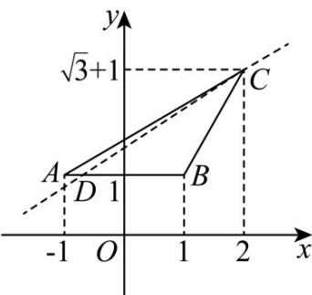

> [!faq]- 《专题01 直线的倾斜角、斜率及方程的四大常考题型（高效培优专项训练）》官方解析
>
> > [!success]- **【答案】** (1)答案见解析 (2) $\left[\frac{\pi}{6},\frac{\pi}{3}\right]$
>
> > [!note]- **【解析】**
> > （1）由斜率公式，得 $k_{AB}=\frac{1-1}{1-(-1)}=0$ ， $k_{BC}=\frac{\sqrt{3}+1-1}{2-1}=\sqrt{3}$ ， $k_{AC}=\frac{\sqrt{3}+1-1}{2-(-1)}=\frac{\sqrt{3}}{3}$ ，
> >
> > 因为斜率等于倾斜角的正切值，且倾斜角的范围是 $[0, \pi)$
> >
> > 所以直线 $AB$ 的倾斜角为0，直线 $BC$ 的倾斜角为 $\frac{\pi}{3}$ ，直线 $AC$ 的倾斜角为 $\frac{\pi}{6}$ 。
> >
> > (2) 如图，当直线 CD 绕点 C 由 CA 逆时针转到 CB 时，
> >
> > 直线 $CD$ 与线段 $AB$ 恒有交点，即 $D$ 在线段 $AB$ 上，此时 $k_{CD}$ 由 $k_{AC}$ 增大到 $k_{BC}$
> >
> > 所以 $k_{CD}$ 的取值范围为 $\left[\frac{\sqrt{3}}{3},\sqrt{3}\right]$
> >
> > 即直线 $CD$ 的倾斜角的取值范围为 $\left[\frac{\pi}{6},\frac{\pi}{3}\right]$
> >
> > 
