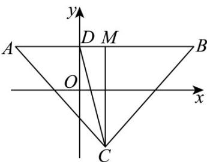

> [!faq]- 《专题01 直线的倾斜角、斜率及方程的四大常考题型（高效培优专项训练）》官方解析
>
> > [!success]- **【答案】** D
>
> > [!note]- **【解析】**
> > 因为 $f(2-x)=(2-x)^{2}-2(2-x)+\ln\left|(2-x)-1\right|=x^{2}-2x+\ln|x-1|=f(x)$
> >
> > 所以 $f(x)$ 的图象关于直线 x=1 对称，故 $\left|CA\right|=\left|CB\right|$ .
> >
> > 因为 $y = x^{2} - 2x, y = \ln |x - 1|$ 在 $(1, +\infty)$ 都单调递增，在 $(- \infty, 1)$ 都单调递减
> >
> > $$
> > f (x) _ {\text {在}} (1, + \infty)
> > $$
> >
> > $$
> > f (x) _ {\text {在}} (- \infty , 1)
> > $$
> >
> > 所以直线 $y = 2$ 与 $y = f(x)$ 的图象只有两个交点 $A(x_{1},2)$ 和点 $B(x_{2},2)(x_{1} < x_{2})$
> >
> > 设 $D(x_0,2)$ ，则 $L_{1} = |CA| + |CD| + |AD|,L_{2} = |CB| + |CD| + |BD|$
> >
> > 设直线 y = 2 与 x = 1 交点为 M ，
> >
> > 所以 $L_{2}-L_{1}=2=\left|BD\right|-\left|AD\right|=2\left|DM\right|=2\left(1-x_{0}\right)$
> >
> > 则 $x_0 = 0$ ，即 $D(0,2)$
> >
> > 因为直线 $l: y = kx + b$ 经过点 $C(1, -2)$ ， $D(0, 2)$ ，
> >
> > 所以 $k=\frac{2-(-2)}{0-1}=-4$
> >
> > 
> >
> > 故选：D
> >
> > 34. 直线 $x - 2y + b = 0$ 与两坐标轴所围成的三角形的面积不大于1，那么 $b$ 的取值范围是（ ）A. $[-2,2]$ B. $(- \infty, - 2] \cup [2, + \infty)$ C. $[-2,0) \cup (0,2]$ D. $(- \infty, + \infty)$
> >
> > 【答案】C
> >
> > 【解析】令 $x = 0$ ，可得 $y = \frac{b}{2}$ ；令 $y = 0$ ，可得 $x = -b$ ，可得 $\frac{1}{2} |\frac{b}{2}\times (-b)|,,1$ ， $b\neq 0$ ，解出即可.
> >
> > 【详解】解：令 $x = 0$ ，可得 $y = \frac{b}{2}$ ；令 $y = 0$ ，可得 $x = -b$
> >
> > $\therefore \frac{1}{2}\left|\frac{b}{2} \times (-b)\right|, 1, b \neq 0,$
> >
> > 解得-2,, b,, 2，且 $b \neq 0$
> >
> > 故选 **C**.
