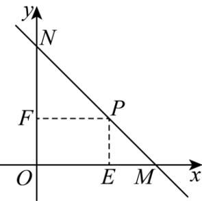

> [!faq]- 《专题01 直线的倾斜角、斜率及方程的四大常考题型（高效培优专项训练）》官方解析
>
> > [!success]- **【答案】** （1） $y = -x + 5$ （2）12
>
> > [!note]- **【解析】**
> > （1）设直线 $l$ 的倾斜角为 $\pi -\theta$ （ $\theta$ 为锐角），
> >
> > 
> >
> > 由 P 点做 x 轴，y 轴垂线，垂足分别为 E，F，则 $PE=2, PF=3$ ，
> >
> > $PM = \frac{PE}{\sin\theta} = \frac{2}{\sin\theta}, PN = \frac{PF}{\cos\theta} = \frac{3}{\cos\theta}$
> >
> > 则 $PM \cdot PN = \frac{3}{\cos \theta} \cdot \frac{2}{\sin \theta} = \frac{12}{\sin 2\theta}$
> >
> > 所以当 $\theta=\frac{\pi}{4}$ 时， $PM\cdot PN$ 取得最小值，
> >
> > 此时直线 l 的方程为 $y = -x + 5$ ;
> >
> > (2) 矩形 OFPE 面积为 $3 \times 2 = 6$ ， $S_{\Delta PEM} = \frac{2}{\tan \theta}$ ， $S_{\Delta PFN} = \frac{9}{2} \tan \theta$ ，
> >
> > $S_{\triangle MON} = 6 + \frac{9}{2}\tan \theta +\frac{2}{\tan\theta}$ 12
> >
> > 当且仅当 $\tan\theta=\frac{2}{3}$ 时取等号，
> >
> > 所以 $\triangle MON$ 面积的最小值为 12.
