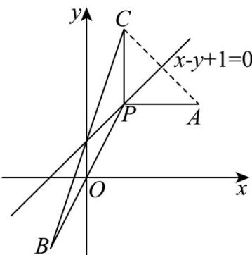

> [!faq]- 《专题02 直线的交点坐标与距离公式 的四大常考题型（高效培优专项训练）》官方解析
>
> > [!success]- **【答案】** (1) $x - y + 1 = 0$ 或 $x - 1 = 0$ (2) $2\sqrt{10}$
>
> > [!note]- **【解析】**
> > （1）由 $\left\{ \begin{array}{l}x - 2y + 3 = 0\\ x + y - 3 = 0 \end{array} \right.$ ，解得 $\left\{ \begin{array}{l}x = 1\\ y = 2 \end{array} \right.$ ，所以交点 $P(1,2)$
> > - **①**：当所求直线与直线 AB 平行时，直线 AB 的斜率为 $k_{AB} = \frac{2 + 2}{3 + 1} = 1$ ，
> > 则所求直线的方程为 $y-2=1\cdot(x-1)$ ，即 $x-y+1=0$ ；
> > - **②**：当所求直线过 $AB$ 的中点时，线段 $AB$ 的中点坐标为 $(1,0)$
> >
> > 则所求直线垂直于 x 轴，故所求直线方程为 x = 1 ，即 x - 1 = 0 ；
> >
> > 综上所述，所求直线方程为 $x - y + 1 = 0$ 或 $x - 1 = 0$
> >
> > (2) 因为点 $A, B$ 在直线 $l$ 的同侧，所以直线 $l$ 的方程为 $x - y + 1 = 0$
> >
> > 
> >
> > 设点A关于直线l的对称点为 $C(x_0,y_0)$
> >
> > 则 $\left\{ \begin{array}{l} \frac{3 + x_0}{2} - \frac{2 + y_0}{2} + 1 = 0 \\ \frac{y_0 - 2}{x_0 - 3} = -1 \end{array} \right.$
> >
> > 解得 $\left\{\begin{aligned}x_{0}&=1\\ y_{0}&=4\end{aligned}\right.$ ，即点 $C(1,4)$ ，
> >
> > 因为 $\left|AQ\right|+\left|BQ\right|\quad\left|CB\right|=\sqrt{(-1-1)^{2}+(-2-4)^{2}}=2\sqrt{10}$
> >
> > 当 $Q, B, C$ 三点共线时等号取到，
> >
> > 故 $\left|AQ\right|+\left|BQ\right|$ 的最小值为 $2\sqrt{10}$ .
