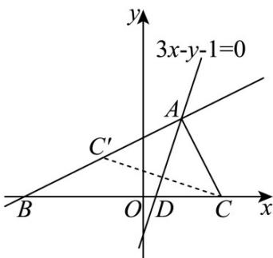

> [!faq]- 《专题02 直线的交点坐标与距离公式 的四大常考题型（高效培优专项训练）》官方解析
>
> > [!success]- **【答案】** 3x-y-1=0，记 $\triangle ABD$ ， $\triangle ACD$ 的面积分别为 $S_{\triangle ABD}$ ， $S_{\triangle ACD}$ (1)求 $S_{\triangle ABD}:S_{\triangle ACD}$ ; (2)求顶点 A 坐标.
>
> > [!note]- **【解析】**
> > （1）由题意可知：直线 $BC:y = 0$
> >
> > 对于直线 $3x - y - 1 = 0$ ，令 $y = 0$ ，可得 $x = \frac{1}{3}$ ，即 $D\left(\frac{1}{3},0\right)$
> >
> > 可得 $\left|BD\right|=\frac{10}{3},\left|CD\right|=\frac{5}{3}$
> >
> > 所以 $S_{\triangle ABD}:S_{\triangle ACD}=\left|BD\right|:\left|CD\right|=2:1$ .
> >
> > (2) 设 $C(2,0)$ 关于直线 3x - y - 1 = 0 对称的点为 $C'(a,b)$
> >
> > 则 $\left\{ \begin{array}{l} \frac{b}{a - 2} = -\frac{1}{3} \\ 3 \times \frac{a + 2}{2} - \frac{b}{2} - 1 = 0 \end{array} \right.$ ，解得 $\left\{ \begin{array}{ll} a = -1 & \text{即} \\ b = 1 & C'(-1,1) \end{array} \right.$ ，
> >
> > 
> >
> > 可知直线 $BC':\frac{y-0}{1-0}=\frac{x+3}{-1+3}$ ，即 $x-2y+3=0$ ，
> >
> > 联立方程 $\left\{ \begin{array}{l}x - 2y + 3 = 0\\ 3x - y - 1 = 0 \end{array} \right.$ ，解得 $\left\{ \begin{array}{l}x = 1\\ y = 2 \end{array} \right.$
> >
> > 所以顶点 A 坐标为 $(1,2)$ .
