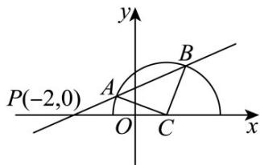

> [!faq]- 《专题02 直线的交点坐标与距离公式 的四大常考题型（高效培优专项训练）》官方解析
>
> > [!success]- **【答案】** D
>
> > [!note]- **【解析】**
> > 曲线 $y = \sqrt{-(x - 1)^2 + 3}$ ，得 $y = 0$ ，则 $(x - 1)^2 + y^2 = 3(y - 0)$
> >
> > 所以曲线 $y = \sqrt{-(x - 1)^2 + 3}$ 表示圆心为 $C(1,0)$ ，半径为 $\sqrt{3}$ 的半圆（ $x$ 轴及以上部分）.
> >
> > 由于 $S_{\triangle ABC} = \frac{1}{2} |CA| \cdot |CB| \sin \angle ACB = \frac{3}{2} \sin \angle ACB$
> >
> > 故当 $CA \perp CB$ 时 $\vee ABC$ 的面积取得最大值，
> >
> > 此时圆心到直线 $l: y = k(x + 2)$ 的距离为 $\sqrt{3} \times \frac{\sqrt{2}}{2} = \frac{\sqrt{6}}{2}$ ，
> >
> > 即 $\frac{|k + 2k|}{\sqrt{k^2 + 1}} = \frac{\sqrt{6}}{2}$ ，如图，只有 $k > 0$ 才可能满足题意，得 $k = \frac{\sqrt{5}}{5}$
> >
> > 
> >
> > 故选 **D**.
