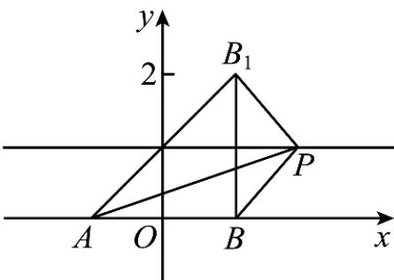

> [!faq]- 《专题02 直线的交点坐标与距离公式 的四大常考题型（高效培优专项训练）》官方解析
>
> > [!success]- **【答案】** A
>
> > [!note]- **【解析】**
> > 设 $A(a,0),B(0,b)$ ，则 $a = 6,b = 8$
> >
> > 即 $A(6,0), B(0,8)$
> >
> > 所以 $\left|AB\right|=\sqrt{(6-0)^{2}+\left(0-8\right)^{2}}=10$
> >
> > 故选：A
> >
> > 15. 函数 $f(x) = \sqrt{(x + 3)^2 + 4} - \sqrt{(x - 1)^2 + 1}$ 的最大值为 \_\_\_\_.
> >
> > 【答案】 $\sqrt{17}$
> >
> > 【详解】∵ $f(x)=\sqrt{\left[x-(-3)\right]^{2}+\left(0-2\right)^{2}}-\sqrt{(x-1)^{2}+\left(0-1\right)^{2}}$
> >
> > $\therefore f(x)$ 表示为点 $P(x,0)$ 与点 $A(-3,2)$ 的距离减去点 $P(x,0)$ 与点 $B(1,1)$ 的距离，
> >
> > 所以 $f(x)=|PA|-|PB|$
> >
> > 又 $\left|PA\right|-\left|PB\right|\leq\left|AB\right|=\sqrt{\left(-3-1\right)^{2}+\left(2-1\right)^{2}}=\sqrt{17}$ ，当P,B,A共线，且P在B的外侧时取等号，
> >
> > $$
> > \sqrt {1 7}
> > $$
> >
> > 故答案为： $\sqrt{17}$
> >
> > 16. 数学家华罗庚曾说：“数缺形时少直观，形少数时难入微”事实上，很多代数问题可以转化为几何问题加以解决。例如，与 $\sqrt{(x - a)^2 + (y - b)^2}$ 相关的代数问题，可以转化为点 $A(x,y)$ 与点 $B(a,b)$ 之间的距离的几何问题。结合上述观点，函数 $f(x) = \sqrt{x^2 + 4x + 5} + \sqrt{x^2 - 4x + 5}$ 的最小值是（）A. $2\sqrt{3}$ B. 4 C. $2\sqrt{5}$ D. $2\sqrt{6}$
> >
> > 【答案】C
> > 【详解】 $f(x) = \sqrt{x^2 + 4x + 5} +\sqrt{x^2 - 4x + 5} = \sqrt{(x + 2)^2 + 1} +\sqrt{(x - 2)^2 + 1}$ $= \sqrt{(x + 2)^2 + (1 - 0)^2} +\sqrt{(x - 2)^2 + (1 - 0)^2}$
> >
> > 表示动点 $P(x,1)$ 到定点 $A(-2,0)$ 和 $B(2,0)$ 的距离之和，
> >
> > 因为点 $P(x,1)$ 在直线 $y = 1$ 上运动，
> >
> > 
> >
> > 作 $B(2,0)$ 关于直线 y=1 的对称点 $B_{1}$ ，则 $B_{1}(2,2)$ ，
> >
> > 故 $\left|PA\right|+\left|PB\right|=\left|PA\right|+\left|PB_{1}\right|\quad\left|AB_{1}\right|=\sqrt{\left(2-0\right)^{2}+\left(2+2\right)^{2}}=2\sqrt{5}$
> >
> > 当且仅当 $A, P, B_{1}$ 三点共线时取等，
> >
> > 故 $f(x)$ 的最小值为 $2\sqrt{5}$
> >
> > 故选 **C**
