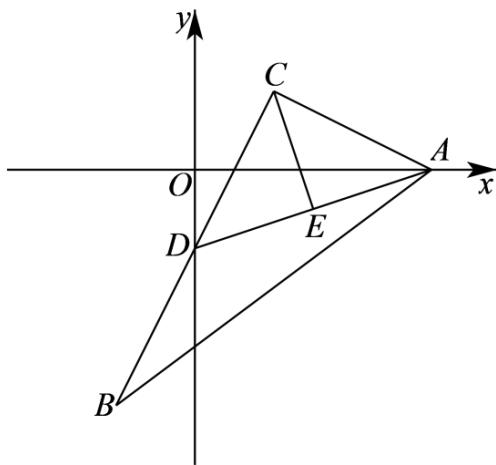
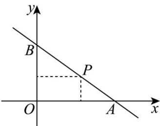

> [!faq]- 《专题02 直线的交点坐标与距离公式 的四大常考题型（高效培优专项训练）》官方解析
>
> > [!success]- **【答案】** (1) $x - 3y - 3 = 0$ (2) $\left(\frac{3}{2},-\frac{1}{2}\right)$ (3)5
>
> > [!note]- **【解析】**
> > （1）解：因为 $B(-1, - 3)$ 、 $C(1,1)$ ，所以 $BC$ 的中点 $D$ 为 $(0, - 1)$
> >
> > 所以直线 $AD$ 的方程为 $\frac{y - 0}{-1 - 0} = \frac{x - 3}{0 - 3}$ ，即 $x - 3y - 3 = 0\cdot$
> >
> > (2) 解：由 (1) 知 $k_{AD} = \frac{1}{3}$ ，因为 $CE \perp AD$ ，所以 $k_{CE} = -3$ ，
> >
> > 所以直线 CE 方程为 $y-1=-3(x-1)$ ，即 $3x+y-4=0$ 。
> >
> > 联立 $\left\{ \begin{array}{l}x - 3y - 3 = 0\\ 3x + y - 4 = 0 \end{array} \right.$ ，解得 $\left\{ \begin{array}{ll}x = \frac{3}{2}\\ y = -\frac{1}{2} \end{array} \right.$ ，所以点的坐标为 $\left(\frac{3}{2}, - \frac{1}{2}\right)\cdot$
> >
> > (3) 解：因为 $\left|AD\right|=\sqrt{\left(3-0\right)^{2}+\left(0+1\right)^{2}}=\sqrt{10}$ ， $\left|CE\right|=\sqrt{\left(1-\frac{3}{2}\right)^{2}+\left[1-\left(-\frac{1}{2}\right)\right]^{2}}=\frac{\sqrt{10}}{2}$ ，
> >
> > 所以 $S_{\triangle ABC} = 2S_{\triangle ACD} = |AD| \cdot |CE| = 5$ .
> >
> > 
> >
> > 19. 过点 $P(2,1)$ 作直线 $l$ 分别交 $x,y$ 的正半轴于 $A,B$ 两点.
> >
> > 
> >
> > (1)求 $\triangle ABO$ 面积的最小值及相应的直线 $l$ 的方程；
> >
> > (2) 当 $\left|PA\right|\cdot\left|PB\right|$ 取最小值时，求直线 l 的方程.
> >
> > 【答案】(1) $\left(S_{\triangle AOB}\right)_{\min}=4$ ，直线l的方程为 $x+2y-4=0$ 。
> >
> > (2) $x + y - 3 = 0$
> >
> > 【详解】（1）依题意设 $A(a,0),B(0,b),(a,b > 0)$
> >
> > 设直线 l 的方程为 $\frac{x}{a} + \frac{y}{b} = 1$ ，代入 $P(2,1)$ 得 $\frac{2}{a} + \frac{1}{b} = 1$ ，
> >
> > 所以 $\frac{2}{a} +\frac{1}{b} = 1$ $2\sqrt{\frac{2}{ab}}$ ，则 $ab\quad 8$ ，当且仅当 $\frac{2}{a} = \frac{1}{b}$ ，即 $a = 4, b = 2$ 时取等号，
> >
> > 从而 $S_{\triangle AOB} = \frac{1}{2} ab$ 4，当且仅当 $\frac{2}{a} = \frac{1}{b}$ ，即 $a = 4, b = 2$ 时取等号，
> >
> > 此时直线 $l$ 的方程为 $\frac{x}{4} +\frac{y}{2} = 1$ ，即 $x + 2y - 4 = 0$
> >
> > 所以 $\left(S_{\triangle AOB}\right)_{\min} = 4$ ，此时直线 $l$ 的方程为 $x + 2y - 4 = 0$
> >
> > (2) 依题意直线 l 的斜率存在且 k < 0，设直线 $l: y - 1 = k(x - 2)$
> >
> > 令 $y = 0$ ，解得 $x = 2 - \frac{1}{k}$ ，令 $x = 0$ ，解得 $y = 1 - 2k$ ，所以 $A\left(2 - \frac{1}{k},0\right),B(0,1 - 2k)$
> >
> > $$
> > P A \mid \cdot \mid P B \mid = \sqrt {\left(4 + 4 k ^ {2}\right) \left(1 + \frac {1}{k ^ {2}}\right)} = \sqrt {8 + 4 \left(k ^ {2} + \frac {1}{k ^ {2}}\right)} \quad \sqrt {8 + 4 \times 2 \sqrt {k ^ {2} \cdot \frac {1}{k ^ {2}}}} = 4
> > $$
> >
> > 当且仅当 $k^{2}=\frac{1}{k^{2}}$ ，即 $k^{2}=1$ ，
> >
> > 即 k = -1 时 $\left| PA \right| \cdot \left| PB \right|$ 取最小值，
> >
> > 此时直线 l 的方程为 $x + y - 3 = 0$ .
