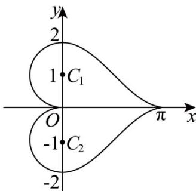
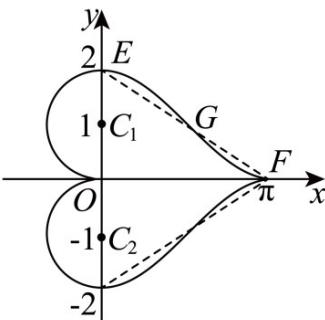

> [!faq]- 《专题03 圆的方程的四大常考题型（高效培优专项训练）》官方解析
>
> > [!success]- **【答案】** D
>
> > [!note]- **【解析】**
> > 由题设，圆心为 $A(3,0)$ ，则 $k_{MN} = -\frac{1}{k_{AP}} = -\frac{3 - 1}{0 - 1} = 2$
> >
> > 故弦 MN 所在直线方程 $y-1=2(x-1)$ ，即为 2x-y-1=0。
> >
> > 故选：D
> >
> > 3．曲线 $|y| = \cos x + 1(0 \leq x \leq \pi)$ 和曲线 $x^{2} + (|y| - 1)^{2} = 1(x \leq 0)$ 组合围成“心形图”（如下图所示），记“心形图”为曲线 $C$ ，曲线 $C$ 所围成的“心形”区域的面积等于（）
> >
> > 【答案】
> >
> > 
> >
> > A. $\pi +6$ B. $\pi +8$ C. $3\pi$ D. $4\pi$
> >
> > 【答案】C
> >
> > 【详解】如图所示，设 $F(\pi,0),E(0,2)$ ，线段 $EF$ 的中点为 $G\left(\frac{\pi}{2},1\right)$
> >
> > 
> >
> > 因为曲线 $y = \cos x + 1 (0 \leq x \leq \pi)$ 关于点 G 对称，
> >
> > 所以可将曲线 $y = \cos x + 1(0 \leq x \leq \pi)$ 与 $x$ 轴， $y$ 轴围成的区域割补为直角三角形 $OEF$ 的区域，于是曲线 $y = \cos x + 1(0 \leq x \leq \pi)$ 与 $x$ 轴， $y$ 轴围成的区域面积就是直角三角形 $OEF$ 的面积，即 $S_{\triangle OEF} = \frac{1}{2} |OE| \cdot |OF| = \frac{1}{2} \times 2 \times \pi = \pi$ ；
> >
> > 根据对称性，可得曲线 $y = -\cos x - 1 (0 \leq x \leq \pi)$ 与 x 轴，y 轴围成的区域面积为 $\pi$ ，又曲线 C 所围成的“心形”区域中，两个半圆的面积为 $\frac{1}{2} \times \pi \times 1^{2} + \frac{1}{2} \times \pi \times 1^{2} = \pi$ ，所以曲线 C 所围成的“心形”区域的面积等于 $\pi + \pi + \pi = 3\pi$ .
> >
> > 故选 **C**.
