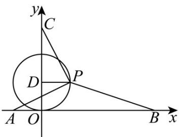
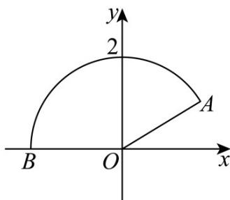

> [!faq]- 《专题03 圆的方程的四大常考题型（高效培优专项训练）》官方解析
>
> > [!success]- **【答案】** D
>
> > [!note]- **【解析】**
> > 由 $x^{2} + y^{2} - 2y = 0$ ，则 $x^{2} + (y - 1)^{2} = 1$ ，如下图示，
> >
> > 
> >
> > 令 $P(\cos \theta, 1 + \sin \theta)$ 且 $\theta \in [0, 2\pi)$ ，则 $PA = (-1 - \cos \theta, -1 - \sin \theta)$ ， $PB = (4 - \cos \theta, -1 - \sin \theta)$ ， $PC = (-\cos \theta, 2 - \sin \theta)$ ， $PA \cdot PB = (-1 - \cos \theta)(4 - \cos \theta) + (-1 - \sin \theta)(-1 - \sin \theta)$ $= \cos^2 \theta - 3\cos \theta - 4 + \sin^2 \theta + 2\sin \theta + 1$ $= 2\sin \theta - 3\cos \theta - 2$ ， $PB \cdot PC = (4 - \cos \theta)(-\cos \theta) + (-1 - \sin \theta)(2 - \sin \theta)$ $= \cos^2 \theta - 4\cos \theta + \sin^2 \theta - \sin \theta - 2$ $= -4\cos \theta - \sin \theta - 1$ ， $PC \cdot PA = (-\cos \theta)(-1 - \cos \theta) + (2 - \sin \theta)(-1 - \sin \theta)$ $= \cos^2 \theta + \cos \theta + \sin^2 \theta - \sin \theta - 2$ $= \cos \theta - \sin \theta - 1$ ，
> > 所以 $PA \cdot PB + PB \cdot PC + PC \cdot PA = 2\sin \theta - 3\cos \theta - 2 - 4\cos \theta - \sin \theta - 1 + \cos \theta - \sin \theta - 1$ $= -6\cos \theta - 4$ ，
> > 当 $\cos \theta = 1$ 时， $PA \cdot PB + PB \cdot PC + PC \cdot PA$ 有最小值为-10·
> >
> > 故选：D
> >
> > 5. 曲线 $y = \sqrt{4 - x^2} (x \leq \sqrt{3})$ 的长度为（） A. $2\pi$ B. $\frac{4\pi}{3}$ C. $\pi$ D. $\frac{5\pi}{3}$
> >
> > 【答案】D
> >
> > 【详解】由 $y=\sqrt{4-x^{2}}\left(x\leq\sqrt{3}\right)$ ，得 $x^{2}+y^{2}=4\left(x\leq\sqrt{3},y=0\right)$ ，
> >
> > 所以曲线 $y = \sqrt{4 - x^2} (x \leq \sqrt{3})$ 是以坐标原点 $O$ 为圆心， $^2$ 为半径的圆弧 $AB$ ，
> >
> > 其中点 A 的横坐标为 $\sqrt{3}$ ，则 $\angle A O x = \frac{\pi}{6}$ ， $\angle A O B = \pi - \frac{\pi}{6} = \frac{5\pi}{6}$ ，
> >
> > 故曲线 $y = \sqrt{4 - x^2} (x \leq \sqrt{3})$ 的长度为 $\frac{5\pi}{6} \times 2 = \frac{5\pi}{3}$ .
> >
> > 
