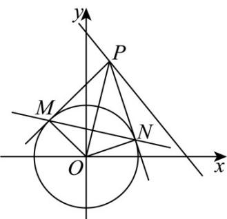

> [!faq]- 《专题03 圆的方程的四大常考题型（高效培优专项训练）》官方解析
>
> > [!success]- **【答案】** C
>
> > [!note]- **【解析】**
> > 
> >
> > 由图可知， $OM\perp PM,ON\perp PN$ ，所以 $O,M,N,P$ 四点共圆，设 $P(m,n)$ ，则该圆心为 $\left(\frac{m}{2},\frac{n}{2}\right)$ ，半径为 $\frac{\sqrt{m^2 + n^2}}{2}$ 所以该圆方程为 $\left(x - \frac{m}{2}\right)^2 +\left(y - \frac{n}{2}\right)^2 = \frac{m^2 + n^2}{4}$
> >
> > 整理得： $x^{2} - mx + y^{2} - ny = 0$ ，由它与圆的方程 $x^{2} + y^{2} = 2$ 相减，得两圆相交弦MN的方程： $mx + ny - 2 = 0$
> >
> > 所以圆心 $O$ 到直线 $MN$ 的距离为： $d = \frac{2}{\sqrt{m^2 + n^2}}$ ，
> >
> > 又因为点 $P(m,n)$ 在直线 $4x + 3y - 10 = 0$ 上，则 $4m + 3n - 10 = 0$
> >
> > 代入消元得： $d = \frac{2}{\sqrt{m^2 + \left(\frac{10 - 4m}{3}\right)^2}} = \frac{2}{\sqrt{\frac{25}{9} m^2 - \frac{80}{9} m + \frac{100}{9}}} = \frac{6}{\sqrt{5}\sqrt{5m^2 - 16m + 20}}$ $= \frac{6}{\sqrt{5}\sqrt{5\left(m - \frac{8}{5}\right)^2 + \frac{36}{5}}} \leq \frac{6}{\sqrt{5}\sqrt{\frac{36}{5}}} = 1$ ，当 $m = \frac{8}{5}$ 时取等号·
> >
> > 故选 **C**.
