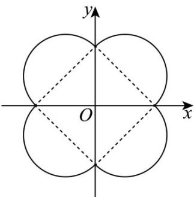

> [!faq]- 《专题03 圆的方程的四大常考题型（高效培优专项训练）》官方解析
>
> > [!success]- **【答案】** B
>
> > [!note]- **【解析】**
> > 当 $x > 0, y > 0$ 时，曲线为 $(x - \frac{1}{2})^2 + (y - \frac{1}{2})^2 = \frac{1}{2}$ 当 $x > 0 > y$ 时，曲线为 $(x - \frac{1}{2})^2 + (y + \frac{1}{2})^2 = \frac{1}{2}$ ，当 $x < 0, y < 0$ 时，曲线为 $(x + \frac{1}{2})^2 + (y + \frac{1}{2})^2 = \frac{1}{2}$ ，当 $x < 0 < y$ 时，曲线为 $(x + \frac{1}{2})^2 + (y - \frac{1}{2})^2 = \frac{1}{2}$ ，同时点 $(0,0), (\pm 1,0), (0, \pm 1)$ 均在曲线上，如下图，
> >
> > 
> >
> > 围成图形是 $^{4}$ 个半径均为 $\frac{\sqrt{2}}{2}$ 的半圆，与 $^{1}$ 个边长为 $\sqrt{2}$ 的正方形组成，
> > 所以图形面积为 $4 \times \frac{1}{2} \times \pi \times \left( \frac{\sqrt{2}}{2} \right)^{2} + (\sqrt{2})^{2} = \pi + 2$ .
> >
> > 故选 **B**
