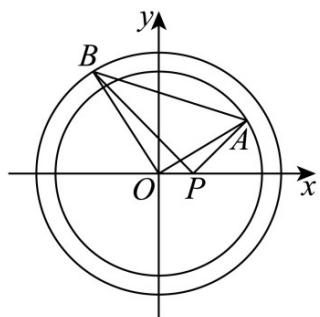

> [!faq]- 《专题03 圆的方程的四大常考题型（高效培优专项训练）》官方解析
>
> > [!success]- **【答案】** ①在坐标平面内存在点 $P$ ，使得 $AP \perp BP$ 恒成立； ②三角形 $OAB$ 面积的最小值为 $\sqrt{22}$ . A. ①是真命题，②是真命题 B. ①是假命题，②是真命题 C. ①是真命题，②是假命题 D. ①是假命题，②是假命题
>
> > [!note]- **【解析】**
> > $x_{1}x_{2}+y_{1}y_{2}=x_{1}+x_{2}-1\Rightarrow x_{1}x_{2}-x_{1}-x_{2}+1+y_{1}y_{2}=0\Rightarrow$ $(x_{1}-1)(x_{2}-1)+y_{1}y_{2}=0$ ，则当 $P(1,0)$ 时， $AP=(1-x_{1},-y_{1})$ ， $BP=(1-x_{2},-y_{2})$ ， $AP\cdot BP=(1-x_{1})(1-x_{2})+y_{1}y_{2}=0$ ，
> > 即当 $P(1,0)$ 时， $AP\perp BP$ 恒成立，则①是真命题；
> > 设 $A(3\cos\theta,3\sin\theta),B(2\sqrt{3}\cos\beta,2\sqrt{3}\sin\beta)$ ，
> > 则 $OA=(3\cos\theta,3\sin\theta),OB=(2\sqrt{3}\cos\beta,2\sqrt{3}\sin\beta)$ ，
> > 又 $\cos\angle AOB=\frac{OA\cdot OB}{|OA|\cdot|OB|}=\frac{6\sqrt{3}\cos\theta\cos\beta+6\sqrt{3}\sin\theta\sin\beta}{3\cdot2\sqrt{3}}=\cos(\theta-\beta)$ ，
> > 则 $S_{\triangle AOB}=\frac{1}{2}|OA||OB|\sin\angle AOB=3\sqrt{3}|\sin(\theta-\beta)|$ .
> > 因 $x_{1}x_{2}+y_{1}y_{2}=x_{1}+x_{2}-1$ ，
> > 则 $6\sqrt{3}\cos\theta\cos\beta+6\sqrt{3}\sin\theta\sin\beta=3\cos\theta+2\sqrt{3}\cos\beta-1$ ，
> > 则 $6\sqrt{3}\cos(\theta-\beta)=3\cos\theta+2\sqrt{3}\cos\beta-1$ ，
> > 则 $6\sqrt{3}\cos(\theta-\beta)=3\cos\theta+2\sqrt{3}\cos\beta-1$ ，
> >
> > $$
> > 6 \sqrt {3} \cos \alpha = 3 \cos \theta + 2 \sqrt {3} \cos (\theta - \alpha) - 1
> > $$
> >
> > $$
> > \text {即} 6 \sqrt {3} \cos \alpha = 3 \cos \theta + 2 \sqrt {3} \cos \theta \cos \alpha + 2 \sqrt {3} \sin \theta \sin \alpha - 1
> > $$
> >
> > $$
> > \text { 则 } 6 \sqrt {3} \cos \alpha + 1 = \left(3 + 2 \sqrt {3} \cos \alpha\right) \cos \theta + 2 \sqrt {3} \sin \alpha \sin \theta
> > $$
> >
> > $$
> > = \sqrt {\left(3 + 2 \sqrt {3} \cos \alpha\right) ^ {2} + \left(2 \sqrt {3} \sin \alpha\right) ^ {2}} \cos (\theta - \gamma), \text {其中} \tan \gamma = \frac {2 \sqrt {3} \sin \alpha}{3 + 2 \sqrt {3} \cos \alpha},
> > $$
> >
> > $$
> > \gamma \in \left(- \frac {\pi}{2}, \frac {\pi}{2}\right) \text {, 则} \cos (\theta - \gamma) = \frac {6 \sqrt {3} \cos \alpha + 1}{\sqrt {(3 + 2 \sqrt {3} \cos \alpha) ^ {2} + (2 \sqrt {3} \sin \alpha) ^ {2}}},
> > $$
> >
> > $$
> > \text {因} _ {\cos (\theta - \gamma) \in [ - 1, 1 ]}, \text {则} \frac {6 \sqrt {3} \cos \alpha + 1}{\sqrt {(3 + 2 \sqrt {3} \cos \alpha) ^ {2} + (2 \sqrt {3} \sin \alpha) ^ {2}}} \in [ - 1, 1 ] \Rightarrow
> > $$
> >
> > $$
> > \frac {\left(6 \sqrt {3} \cos \alpha + 1\right) ^ {2}}{\left(3 + 2 \sqrt {3} \cos \alpha\right) ^ {2} + \left(2 \sqrt {3} \sin \alpha\right) ^ {2}} \in [ 0, 1 ] \Rightarrow (6 \sqrt {3} \cos \alpha + 1) ^ {2} \leq (3 + 2 \sqrt {3} \cos \alpha) ^ {2} + (2 \sqrt {3} \sin \alpha) ^ {2},
> > $$
> >
> > $$
> > \text {则} 1 0 8 \cos^ {2} \alpha \leq 2 0 \Rightarrow 1 0 8 \left(1 - \sin^ {2} \alpha\right) \leq 2 0 \Rightarrow \sin^ {2} \alpha \quad {\frac {2 2}{2 7}} \Rightarrow | \sin \alpha | \quad {\frac {\sqrt {2 2}}{3 {\sqrt {3}}}} ,
> > $$
> >
> > 则 $S_{\triangle AOB} = 3\sqrt{3}\left|\sin (\theta -\beta)\right| = 3\sqrt{3}\left|\sin \alpha \right|\quad \sqrt{22}$ ，故②是真命题·
> >
> > 故选：A.
> >
> > 
