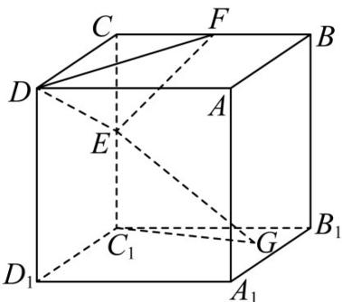

> [!faq]- 《专题03 圆的方程的四大常考题型（高效培优专项训练）》官方解析
>
> > [!success]- **【答案】**  A. $2\sqrt{5}\pi$ B. $\frac{\sqrt{5}\pi}{2}$ C. $2\sqrt{3}\pi$ D. $\frac{\sqrt{3}\pi}{2}$
>
> > [!note]- **【解析】**
> > 因为正方体 $ABCD - A_{1}B_{1}C_{1}D_{1}$ 的体积为8，故 $AA_{1} = 2$
> >
> > $GE = AA_{1}$ ，则 $GE = 2$ ，而 $EC_{1} = 1$
> >
> > 故 $C_1G = \sqrt{GE^2 - EC_1^2} = \sqrt{3}$
> >
> > 
> >
> > 故动点 $G$ 的轨迹为以 $C_1$ 为圆心， $\sqrt{3}$ 为半径的圆在底面 $A_1B_1C_1D_1$ 内的部分，
> >
> > 即四分之一圆弧，
> >
> > 故所求轨迹长度为 $\frac{1}{4} \times 2\pi \times \sqrt{3} = \frac{\sqrt{3}\pi}{2}$ ;
> >
> > 故选 **D**
