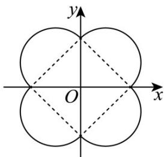

> [!faq]- 《专题03 圆的方程的四大常考题型（高效培优专项训练）》官方解析
>
> > [!success]- **【答案】** BD
>
> > [!note]- **【解析】**
> > 当 $x > 0$ ， $y > 0$ 时，曲线 $E: \left(x - \frac{\sqrt{2}}{2}\right)^2 + \left(y - \frac{\sqrt{2}}{2}\right)^2 = 1$ ；当 $x > 0$ ， $y < 0$ 时，曲线 $E: \left(x - \frac{\sqrt{2}}{2}\right)^2 + \left(y + \frac{\sqrt{2}}{2}\right)^2 = 1$ ；当 $x < 0$ ， $y > 0$ 时，曲线 $E: \left(x + \frac{\sqrt{2}}{2}\right)^2 + \left(y - \frac{\sqrt{2}}{2}\right)^2 = 1$ ；当 $x < 0$ ， $y < 0$ 时，曲线 $E: \left(x + \frac{\sqrt{2}}{2}\right)^2 + \left(y + \frac{\sqrt{2}}{2}\right)^2 = 1$ 。因为 $x^2 + y^2 \neq 0$ ，所以 $x$ ， $y$ 不同时为 $0$ ，
> >
> > 画出曲线 E ，如图所示·
> >
> > 
> >
> > 曲线 E 围成的图形可分割为 $^{1}$ 个边长为 $^{2}$ 的正方形和 $^{4}$ 个半径为 $^{1}$ 的半圆，
> >
> > 故面积为 $2 \times 2 + 2\pi = 4 + 2\pi$ ，故A项错误；
> >
> > 曲线 E 由 $^{4}$ 个半径为 $^{1}$ 的半圆弧组成，故周长为 $2 \times 2\pi \times 1 = 4\pi$ ，故 B 项正确；
> >
> > 结合图可知曲线 E 上的点到原点的距离的最大值为 $^{2}$ ，故 C 项错误；
> >
> > 当曲线 E 上的两点的连线同时过圆心及原点时，两点间的距离最大，最大距离为 $^{4}$ ，故 D 项正确
> >
> > 故选 **BD**
