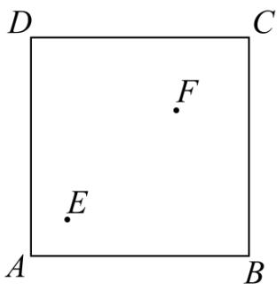
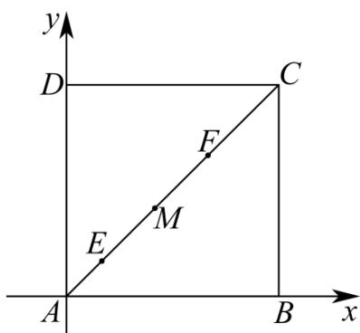

> [!faq]- 《专题03 圆的方程的四大常考题型（高效培优专项训练）》官方解析
>
> > [!success]- **【答案】** -7 (-8,2)
>
> > [!note]- **【解析】**
> > 设VABC的外接圆方程为 $x^{2}+y^{2}+Dx+Ey+F=0$ ， $D^{2}+E^{2}-4F>0$ ，
> >
> > 则 $\left\{ \begin{array}{l}26 + 5D + E + F = 0\\ 58 + 7D - 3E + F = 0\\ 68 + 2D - 8E + F = 0 \end{array} \right.$ ，解得 $D = -4,E = 6,F = -12$ 于是VABC的外接圆方程为 $x^{2} + y^{2} - 4x + 6y - 12 = 0$ ，即 $(x - 2)^{2} + (y + 3)^{2} = 25$ ，其圆心 $(2, - 3)$ ，由点 $(2, - 3)$ 在直线 $y = 2x + b$ 上，得 $-3 = 2\times 2 + b$ ，解得 $b = -7$
> >
> > 由点 $(2,m)$ 在VABC的外接圆内，得 $2^{2} + m^{2} - 4\times 2 + 6m - 12 <   0$ ，解得 $-8 <   m <   2$
> >
> > 所以 m 的取值范围为 $(-8,2)$ .
> >
> > 故答案为：-7；(-8,2)
> >
> > 13．正方形草地 ABCD 边长 1.2, E 到 AB, AD 距离为 0.2, F 到 BC, CD 距离为 0.4，有个圆形通道经过 E, F，且经过 AD 上一点，求圆形通道的周长 \_\_\_\_ ·（精确到 0.01）
> >
> > 
> >
> > 【答案】2.73
> >
> > 【详解】如图，以A为原点建系，易知 $E(0.2,0.2),F(0.8,0.8)$ ，连接EF，
> >
> > 
> >
> > 不妨设 $EF$ 中点为 $M(0.5,0.5)$ ，直线 $EF$ 中垂线所在直线方程为 $y - 0.5 = -(x - 0.5)$
> >
> > 化简得 $y = -x + 1$ ，所以圆心为 $(a, -a + 1)$ ，半径为 a，且经过 E, F 点
> >
> > 即 $(a-0.2)^{2}+(a+1-0.2)^{2}=a^{2}$ ，化简得 $a^{2}-2a+0.68=0$ ，
> >
> > 解得 $a = \frac{2\pm\sqrt{1.28}}{2} = 1\pm \sqrt{0.32} = 1\pm \frac{2\sqrt{2}}{5}$
> >
> > 结合题意可得 $a = 1 - \frac{2\sqrt{2}}{5} \approx 0.434$ ，故圆的周长为 $C = 2\pi a \approx 2.73$ 。
> >
> > 故答案为：2.73
