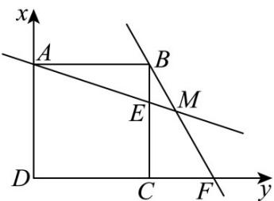

> [!faq]- 《专题03 圆的方程的四大常考题型（高效培优专项训练）》官方解析
>
> > [!success]- **【答案】** (1)13； (2) $x^{2}+y^{2}-\frac{31}{13}x-\frac{33}{13}y-\frac{100}{13}=0$ .
>
> > [!note]- **【解析】**
> > （1） $\left|AB\right|=\sqrt{(-2-1)^{2}+(2+2)^{2}}=5$ ，
> >
> > 直线 $AB$ 的方程为 $y - 2 = \frac{2 - (-2)}{-2 - 1} (x + 2)$ ，即 $4x + 3y + 2 = 0$ ，
> >
> > 所以点 $C(3,4)$ 到直线 $_{AB}$ 的距离 $d=\frac{|4\times3+3\times4+2|}{\sqrt{3^{2}+4^{2}}}=\frac{26}{5}$
> >
> > 所以VABC的面积 $S=\frac{1}{2}\times5\times\frac{26}{5}=13$ ；
> >
> > (2) 设 VABC 的外接圆的方程为 $x^{2} + y^{2} + Dx + Ey + F = 0$
> >
> > 则 $\left\{ \begin{array}{l}4 + 4 - 2D + 2E + F = 0\\ 1 + 4 + D - 2E + F = 0\\ 9 + 16 + 3D + 4E + F = 0 \end{array} \right.$ ，解得 $\left\{ \begin{array}{l}D = -\frac{31}{13}\\ E = -\frac{33}{13}\\ F = -\frac{100}{13} \end{array} \right.$
> >
> > 所以VABC的外接圆的方程为 $x^{2} + y^{2} - \frac{31}{13} x - \frac{33}{13} y - \frac{100}{13} = 0$
> >
> > 18. 正方形 $ABCD$ 的边长为 $2$ ，在边 $BC$ 上取线段 $BE = \frac{2}{3}$ ，在边 $DC$ 的延长线上取 $CF = 1$ ，直线 $AE$ 与 $BF$
> >
> > 的交于 $M$
> >
> > (1)求线段 $EM$ 长；
> >
> > (2)求证： $A$ ， $B$ ， $M$ ， $C$ 四点共圆·
> >
> > 【答案】(1) $\frac{2\sqrt{10}}{15}$ ;
> >
> > (2)证明见解析·
> >
> > 【详解】（1）由题可以 $D$ 为原点， $DA, DC$ 分别为 $x$ 、 $y$ 轴建立如图所示的平面直角坐标系，
> >
> > 
> >
> > 则由题 $A(0,2),B(2,2),C(2,0),E\left(2,\frac{4}{3}\right),F(3,0)$
> >
> > 故 $k_{AE} = \frac{\frac{4}{3} - 2}{2 - 0} = -\frac{1}{3}, k_{BF} = \frac{0 - 2}{3 - 2} = -2$
> >
> > 所以直线 $AE$ 的方程为 $y - 2 = -\frac{1}{3} x$ 即 $x + 3y - 6 = 0$
> >
> > 直线 BF 的方程为 $y-2=-2(x-2)$ 即 $2x+y-6=0$
> >
> > 联立 $\left\{ \begin{array}{l}x + 3y - 6 = 0\\ 2x + y - 6 = 0 \end{array} \right.\Rightarrow \left\{ \begin{array}{ll}x = \frac{12}{5}\\ y = \frac{6}{5} \end{array} \right.$ ，故 $M\left(\frac{12}{5},\frac{6}{5}\right)$
> >
> > 所以线段 $EM$ 长为 $|EM| = \sqrt{\left(\frac{12}{5} - 2\right)^2 + \left(\frac{6}{5} - \frac{4}{3}\right)^2} = \sqrt{\frac{4}{25} + \frac{4}{225}} = \frac{2\sqrt{10}}{15}$ .
> >
> > (2) 证明：设过点 A, B, C 三点的圆的方程为 $x^{2} + y^{2} + Dx + Ey + F = 0$
> >
> > 则 $\left\{ \begin{array}{l}4 + 2E + F = 0\\ 8 + 2D + 2E + F = 0\Rightarrow \left\{ \begin{array}{l}D = -2\\ E = -2\\ F = 0 \end{array} \right. \end{array} \right.$
> >
> > 故该圆方程为 $x^{2} + y^{2} - 2x - 2y = 0$ ，
> >
> > 将 $M\left(\frac{12}{5},\frac{6}{5}\right)$ 代入该圆方程得 $\left(\frac{12}{5}\right)^{2}+\left(\frac{6}{5}\right)^{2}-2\times\frac{12}{5}-2\times\frac{6}{5}=0$
> >
> > 故点 $M\left(\frac{12}{5}, \frac{6}{5}\right)$ 在该圆上，所以 $A, B, M, C$ 四点共圆
