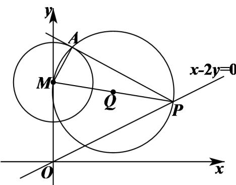

> [!faq]- 《专题03 圆的方程的四大常考题型（高效培优专项训练）》官方解析
>
> > [!success]- **【答案】** （1） $x^{2} + (y - 2)^{2} = 1$ ；（2）圆 $Q$ 过定点 $\left(\frac{4}{5}, \frac{2}{5}\right)$ .
>
> > [!note]- **【解析】**
> > （1）将圆M的方程化为标准方程得 $x^{2}+(y-2)^{2}=1$ ；
> >
> > (2) 如下图所示，连接 AM，
> >
> > 
> >
> > 设点 $P$ 的坐标为 $(2t,t)$ ，由圆的切线的性质可得 $AM \perp AP$
> >
> > 所以，圆 $Q$ 是以 $PM$ 为直径的圆，
> >
> > 圆心 $Q$ 的坐标为 $\left(t, \frac{t + 2}{2}\right)$ ，半径为 $R = \frac{1}{2} |PM| = \frac{\sqrt{4t^2 + (t - 2)^2}}{2} = \frac{\sqrt{5t^2 - 4t + 4}}{2}$ ，
> >
> > 所以，圆 $Q$ 的方程为 $\left(x - t\right)^2 +\left(y - \frac{t + 2}{2}\right)^2 = \frac{5t^2 - 4t + 4}{4}$
> >
> > 整理得 $\left(x^{2} + y^{2} - 2y\right) - t(2x + y - 2) = 0$
> >
> > 联立 $\left\{\begin{aligned}x^{2}+y^{2}-2y=0\\ 2x+y-2=0\end{aligned}\right.$ ，解得 $\left\{\begin{aligned}x=0&(\text{舍去})\text{或}\\ y=2\end{aligned}\right.$ $\left\{\begin{aligned}x=\frac{4}{5}\\ y=\frac{2}{5}\end{aligned}\right.$
> >
> > 因此，圆 $Q$ 过定点 $\left(\frac{4}{5},\frac{2}{5}\right)$
