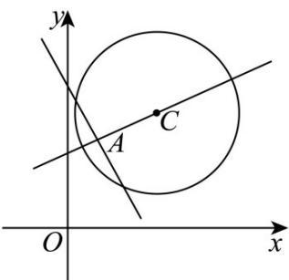

> [!faq]- 《专题04 直线与圆、圆与圆的位置关系的四大常考题型（高效培优专项训练）》官方解析
>
> > [!success]- **【答案】** B
>
> > [!note]- **【解析】**
> > 由题意直线 $l$ 可化为 $m(x - 1) + y - 3 = 0$ ，则直线过定点 $A(1,3)$
> >
> > 点 $A(1,3)$ 代入圆 $C:(x - 3)^{2} + (y - 4)^{2} = 8$ 可得 $\left(1 - 3\right)^2 +\left(3 - 4\right)^2 < 8$ ，所以点A在圆 $C$ 内，
> >
> > 
> >
> > 又圆 $C$ 半径 $r = 2\sqrt{2}$ ，圆心 $C(3,4)$ ， $AC = \sqrt{(3 - 1)^2 + (4 - 3)^2} = \sqrt{5}$
> >
> > 所以当 $AC \perp l$ 时，直线 $l$ 被圆 $C$ 截得弦长最短，即 $b = 2\sqrt{r^2 - AC^2} = 2\sqrt{3}$
> >
> > 当 $l$ 过圆心 $C$ 时，直线 $l$ 被圆 $C$ 截得弦长最长，即 $a = 2r = 4\sqrt{2}$
> >
> > 所以 $a - b = 4\sqrt{2} - 2\sqrt{3}$
> >
> > 故选 **B**.
