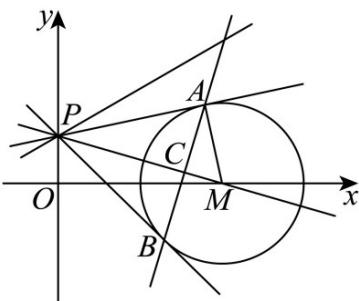

> [!faq]- 《专题04 直线与圆、圆与圆的位置关系的四大常考题型（高效培优专项训练）》官方解析
>
> > [!success]- **【答案】** ACD
>
> > [!note]- **【解析】**
> > 
> >
> > 因为圆 M 的圆心 M 在 x 轴上，且与直线 x=1 和 x=3 都相切，
> >
> > 所以圆 M 的标准方程为 $(x-2)^{2}+y^{2}=1$ ，故 A 正确；
> >
> > 对于 B，因为 PA, PB 是圆 M 的切线，所以 $\left|PA\right|=\left|PB\right|=\sqrt{\left|PM\right|^{2}-1}$
> >
> > 在 Rt△APM 中， $\sin\angle APM=\frac{|AM|}{|PM|}=\frac{1}{|PM|}$
> >
> > 当 m=1 时， $P(0,2)$ ，又 $M(2,0)$ ，所以 $\left|PM\right|=\sqrt{4+4}=2\sqrt{2}$ ，
> >
> > 则 $|PA| = \sqrt{7}$ ，所以四边形PAMB的面积 $S = 2S_{\triangle PAM} = |AM| \cdot |PA| = 1 \times \sqrt{7} = \sqrt{7}$
> >
> > 故 $^{B}$ 错误·
> >
> > 对于 C， $\overline{PA} \cdot \overline{PB} = \left| \overline{PA} \right| \left| \overline{PB} \right| \cos \angle APB = (|PM|^2 - 1)(1 - 2\sin^2 \angle APM)$
> >
> > $$
> > = \left(\left| P M \right| ^ {2} - 1\right) \left(1 - \frac {2}{\left| P M \right| ^ {2}}\right) = \left| P M \right| ^ {2} + \frac {2}{\left| P M \right| ^ {2}} - 3.
> > $$
> >
> > 因为 $|PM| > |OM| = 2$ ，所以 $|PM|^{2} \in (4, +\infty)$ ，
> >
> > 因为对勾函数 $y = x + \frac{2}{x}$ 在 $(4, +\infty)$ 上单调递增，所以 $PA \cdot PB \in \left(\frac{3}{2}, +\infty\right) \cdot \text{故}^C$ 正确.
> >
> > 对于 $\mathbb{D}$ ，由题意，知 $m\neq 0$ ， $P\left(0,\frac{2}{m}\right)$ ， $M(2,0)$ ， $\angle PAM = \angle PBM = 90^{\circ}$
> >
> > 所以 A, M, B, P 四点共圆，
> >
> > 记此圆为圆 D，则 PM 为圆 D 的直径，圆心 $D\left(1,\frac{1}{m}\right)$ ，半径为 $\frac{\sqrt{4+\left(\frac{2}{m}\right)^{2}}}{2}=\sqrt{1+\frac{1}{m^{2}}}$ ，
> >
> > 圆 D 的方程为 $(x-1)^{2}+\left(y-\frac{1}{m}\right)^{2}=1+\frac{1}{m^{2}}$ .
> >
> > 因为 AB 是圆 D 与圆 M 的相交弦，
> >
> > 所以直线 $AB$ 的方程为 $(x - 1)^2 +\left(y - \frac{1}{m}\right)^2 -(x - 2)^2 -y^2 = 1 + \frac{1}{m^2} -1$
> >
> > 化简得 $-2x + \frac{2}{m}y + 3 = 0$ ，所以直线 AB 经过定点 $N\left(\frac{3}{2}, 0\right)$ .
> >
> > 因为 $PM \perp AB$ ，所以 $\angle MCA = 90^{\circ}$
> >
> > 因为点 $N\left(\frac{3}{2},0\right)$ 在直线 $AB$ 上，所以 $\angle MCN = 90^{\circ}$ ，即点 $C$ 在以 $MN$ 为直径的圆上。
> >
> > 因为 $M(2,0)$ ， $N\left(\frac{3}{2},0\right)$ ，所以圆心为点 $\left(\frac{7}{4},0\right)$ ，恰为 $Q$ 点，半径为 $\frac{|MN|}{2} = \frac{1}{4}$ .
> >
> > 因为点 $C$ 在该圆上，所以 $|CQ| = \frac{1}{4}$ 为定值·故 $\mathbf{D}$ 正确·
> >
> > 故选 **ACD**.
