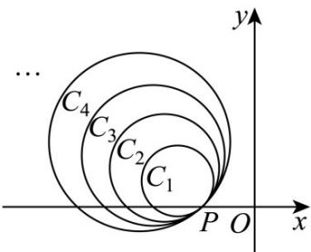

> [!faq]- 《专题04 直线与圆、圆与圆的位置关系的四大常考题型（高效培优专项训练）》官方解析
>
> > [!success]- **【答案】**  A. 圆 $C_k$ 的圆心都在直线 $x + y + 2 = 0$ 上 B. 圆 $C_9$ 的方程为 $(x + 7)^2 + (y - 5)^2 = 50$ C. 若 $k - 9$ ，则圆 $C_k$ 与 $y$ 轴有交点 D. 设直线 $x = -2$ 与圆 $C_k$ 在第二象限的交点为 $B_k$ ，则 $\left|B_k B_{k+1}\right| = 2$
>
> > [!note]- **【解析】**
> > 圆 $C_1$ 的圆心 $C_1(-3,1)$ ，直线 $PC_1$ 的方程为 $y = \frac{1 - 0}{-3 - (-2)} \times (x + 2)$ ，即 $x + y + 2 = 0$ ，
> >
> > 由两圆内切连心线必过切点，得圆 $C_k$ 的圆心都在直线 $PC_{1}$ 上，即圆 $C_k$ 的圆心都在直线 $x + y + 2 = 0$ 上，故A正确；
> >
> > 显然 $\left|PA_{k}\right|=\sqrt{2}(k+1)$ ，设点 $A_{k}(x_{k},y_{k})$ ，则 $\left\{\begin{aligned}x_{k}+y_{k}&=-2\\\sqrt{1^{2}+1^{2}}\left|x_{k}+2\right|=\sqrt{2}(k+1)\end{aligned}\right.$ ，而 $x_{k}<-2$ ，
> >
> > 解得 $x_{k} = -k - 3$ ， $y_{k} = k + 1$ ，因此圆 $C_k$ 的圆心 $C_k\left(-\frac{k + 5}{2},\frac{k + 1}{2}\right)$ ，半径为 $\frac{|PA_k|}{2} = \frac{\sqrt{2}}{2}(k + 1)$
> >
> > 圆 $C_k$ 的方程为 $\left(x + \frac{k + 5}{2}\right)^2 +\left(y - \frac{k + 1}{2}\right)^2 = \frac{(k + 1)^2}{2}$
> >
> > 则圆 $C_{9}$ 的方程为 $(x+7)^{2}+(y-5)^{2}=50$ ，故 B 正确；
> >
> > 圆 $C_k$ 的圆心为 $C_k\left(-\frac{k + 5}{2},\frac{k + 1}{2}\right)$ ，半径 $r_k = \frac{|k + 1|}{\sqrt{2}}$
> >
> > 圆心到 $y$ 轴的距离为 $\left| -\frac{k + 5}{2} \right| = \frac{k + 5}{2}$
> >
> > 由 $\frac{k + 5}{2} \leq \frac{|k + 1|}{\sqrt{2}}$ 两边平方得 $\frac{k^2 + 10k + 25}{4} \leq \frac{k^2 + 2k + 1}{2}$ ，
> >
> > $k^{2}-6k-23=(k-3)^{2}-32\quad0,\quad k\quad3+4\sqrt{2}$ ，而 $k\in N_{+}$
> >
> > 所以当 k 9 时，圆 $C_{k}$ 与 y 轴有交点，C 选项正确.
> >
> > 在 $\left(x+\frac{k+5}{2}\right)^{2}+\left(y-\frac{k+1}{2}\right)^{2}=\frac{(k+1)^{2}}{2}$ 中，令x=-2，得点 $B_{k}$ 的纵坐标为 $k+1$ ，因此 $\left|B_{k}B_{k+1}\right|=1$ ，故D错误。
> >
> > 故选 **ABC**.
