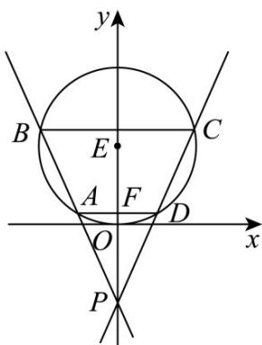

> [!faq]- 《专题04 直线与圆、圆与圆的位置关系的四大常考题型（高效培优专项训练）》官方解析
>
> > [!success]- **【答案】** $\frac{15\sqrt{3}}{4}$
>
> > [!note]- **【解析】**
> > 不妨设点 C, D 在第一象限，设 AD 与 y 轴交点为 F，如图所示，
> >
> > 由圆 $E: x^{2} + y^{2} - 4y = 0$ 得， $x^{2} + (y - 2)^{2} = 4$ ，圆心 $E(0,2)$ ，半径为2，
> >
> > 因为 $\sin \angle BPC = \frac{\sqrt{15}}{8}$ ，所以 $\cos \angle BPC = \frac{7}{8}$
> >
> > 因为四边形 ABCD 为等腰梯形，
> >
> > 所以 $\angle DPF = \frac{1}{2}\angle BPC$ ，点 $A,B$ 与点 $C,D$ 关于 $y$ 轴对称， $BC / / AD / / x$ 轴，
> >
> > 则 $\cos\angle BPC = \cos2\angle DPF = 2\cos^{2}\angle DPF - 1 = \frac{7}{8}$ ，解得 $\cos\angle DPF = \frac{\sqrt{15}}{4}$ ，
> >
> > 所以 $\tan\angle DPF=\frac{\sin\angle DPF}{\cos\angle DPF}=\frac{\sqrt{1-\cos^{2}\angle DPF}}{\cos\angle DPF}=\frac{\sqrt{15}}{15}$
> >
> > 设直线 $CD$ 的倾斜角为 $\alpha = \angle PDF$ ，则直线 $CD$ 的斜率为 $\tan \angle PDF = \frac{PF}{FD} = \frac{1}{\tan \angle FPD} = \sqrt{15}$
> >
> > 设直线 $CD$ 的方程为 $y = \sqrt{15} x - 2$ ， $D(x_{1}, y_{1}), C(x_{2}, y_{2})$
> >
> > 由 $\left\{\begin{aligned}y&=\sqrt{15}x-2\\ x^{2}+(y-2)^{2}&=4\end{aligned}\right.$ 得， $4x^{2}-2\sqrt{15}x+3=0$
> >
> > 解得 $x_{1} = \frac{\sqrt{15} - \sqrt{3}}{4}$ ， $x_{2} = \frac{\sqrt{15} + \sqrt{3}}{4}$ ， $y_{1} = \frac{7 - 3\sqrt{5}}{4}, y_{2} = \frac{7 + 3\sqrt{5}}{4}$
> >
> > $$
> > \left| A D \right| + \left| B C \right| = 2 \times \left(\frac {\sqrt {1 5} + \sqrt {3}}{4} + \frac {\sqrt {1 5} - \sqrt {3}}{4}\right) = \sqrt {1 5}, \left| y _ {1} - y _ {2} \right| = \left| \frac {7 - 3 \sqrt {5}}{4} - \frac {7 + 3 \sqrt {5}}{4} \right| = \frac {3 \sqrt {5}}{2}
> > $$
> >
> > 所以梯形 ABCD 的面积为 $\left(\left|AD\right|+\left|BC\right|\right)\cdot\left|y_{1}-y_{2}\right|\cdot\frac{1}{2}=\sqrt{15}\times\frac{3\sqrt{5}}{2}\times\frac{1}{2}=\frac{15\sqrt{3}}{4}$
> >
> > 故答案为： $\frac{15\sqrt{3}}{4}$
> >
> > 
> >
> > 7. 过点 $P(-2,0)$ 作直线 $l$ 交圆 $C: x^2 + y^2 = 1$ 于点 $M$ ， $N$ ，若 $\overline{PM} = \overline{MN}$ ，则点 $M$ 的横坐标是（）
> >
> > 【答案】
> >
> > A. $-\frac{7}{8}$ B. $-\frac{7}{9}$ C. $-\frac{7}{10}$ D. $\frac{1}{4}$
> >
> > 【答案】A
> >
> > 【详解】设 $M(m,n)$ ，故有 $m^2 + n^2 = 1$ ，即 $n^2 = 1 - m^2$
> >
> > 由 $\overline{PM} = \overline{MN}$ ，则点 M 为 PN 中点，
> >
> > 故 $N(2 + 2m,2n)$ ，故有 $(2 + 2m)^{2} + (2n)^{2} = 1$
> >
> > 即有 $(2+2m)^{2}+4(1-m^{2})=1$ ，整理得 $8m+8=1$ ，
> >
> > 即 $m = -\frac{7}{8}$
> >
> > 故选 **A**.
