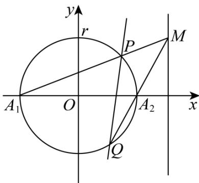

> [!faq]- 《专题04 直线与圆、圆与圆的位置关系的四大常考题型（高效培优专项训练）》官方解析
>
> > [!success]- **【答案】** (1) $2x - y - 2 = 0$ (2)证明见解析，过定点 $\left(\frac{r^2}{a},0\right)$
>
> > [!note]- **【解析】**
> > （1）解法一：当 $r = 2$ ， $M(4,2)$ ，则 $A_{1}(-2,0), A_{2}(2,0)$
> >
> > 则直线 $MA_{1}$ 的方程： $\frac{y - 0}{x + 2} = \frac{2 - 0}{4 + 2}$ ，即 $x - 3y + 2 = 0$
> >
> > 解 $\left\{\begin{aligned}x^{2}+y^{2}&=4,\\ x-3y+2&=0\end{aligned}\right.$ 得 $P\left(\frac{8}{5},\frac{6}{5}\right)$
> >
> > 同理可得直线 $MA_{2}$ 的方程： $x - y - 2 = 0$ ，解 $\left\{ \begin{array}{l} x^{2} + y^{2} = 4, \\ x - y - 2 = 0 \end{array} \right.$ 得 $Q(0, -2)$ .
> >
> > 由两点式得直线 方程为： $\frac{y+2}{x-0}=\frac{\frac{6}{5}+2}{\frac{8}{5}-0}$ ，即 $2x-y-2=0$
> >
> > 解法二：通过 $r = 2$ ， $M(4,2)$ ，求出 $A_{1}(-2,0), A_{2}(2,0)$
> >
> > 则直线 $MA_{1}$ 的方程： $\frac{y - 0}{x + 2} = \frac{2 - 0}{4 + 2}$ ，即 $x - 3y + 2 = 0$
> >
> > 解 $\left\{\begin{aligned}x^{2}+y^{2}&=4,\\ x-3y+2&=0\end{aligned}\right.$ 得 $P\left(\frac{8}{5},\frac{6}{5}\right)$
> >
> > 同理可得直线 $MA_{2}$ 的方程： $x - y - 2 = 0$ ，解 $\left\{ \begin{array}{l} x^{2} + y^{2} = 4, \\ x - y - 2 = 0 \end{array} \right.$ 得 $Q(0, -2)$ .
> >
> > 由 $P, Q$ 在曲线 $(x - 3y + 2)(x - y - 2) + t(x^2 + y^2 - 4) = 0$
> >
> > 则当 $t = -1$ 时，求出直线 $PQ$ 方程为 $2x - y - 2 = 0$
> >
> > (2)
> > 证法一：由题设得 $A_{1}(-r,0), A_{2}(r,0)$ 。设 $M(a,t)$ ，
> >
> > 直线 $MA_{1}$ 的方程是： $y = \frac{t}{a + r}(x + r)$ ，直线 $MA_{2}$ 的方程是： $y = \frac{t}{a - r}(x - r)$ 。解 $\left\{ \begin{array}{l} x^{2} + y^{2} = r^{2}, \\ y = \frac{t}{a + r}(x + r) \end{array} \right.$ 得
> >
> > $$
> > P \left(\frac {r (a + r) ^ {2} - r t ^ {2}}{(a + r) ^ {2} + t ^ {2}}, \frac {2 t r (a + r)}{(a + r) ^ {2} + t ^ {2}}\right)
> > $$
> >
> > 解 $\left\{ \begin{array}{l} x^{2} + y^{2} = r^{2}, \\ y = \frac{t}{a - r} (x - r) \end{array} \right.$ 得 $Q\left(\frac{rt^2 - r(a - r)^2}{(a - r)^2 + t^2}, -\frac{2tr(a - r)}{(a - r)^2 + t^2}\right)$ .
> >
> > 于是直线 PQ 的斜率 $k_{PQ} = \frac{2at}{a^{2} - t^{2} - r^{2}}$ ，
> >
> > 直线 $PQ$ 的方程为 $y - \frac{2tr(a + r)}{(a + r)^2 + t^2} = \frac{2at}{a^2 - t^2 - r^2}\left(x - \frac{r(a + r)^2 - rt^2}{(a + r)^2 + t^2}\right)$ .
> >
> > 上式中令 $y = 0$ ，得 $x = \frac{r^2}{a}$ 是一个与 $t$ 无关的常数.
> >
> > 故直线 $PQ$ 过定点 $\left(\frac{r^2}{a}, 0\right)$
> >
> > 证法二：由题设得 $A_{1}(-r,0)$ ， $A_{2}(r,0)$ .设 $M(a,t)$
> >
> > 直线 $MA_{1}$ 的方程是： $y=\frac{t}{a+r}(x+r)$ ，与圆 C 的交点 P，设为 $P(x_{1},y_{1})$ ，
> >
> > 直线 $MA_{2}$ 的方程是： $y = \frac{t}{a - r}(x - r)$ ，与圆 $C$ 的交点 $Q$ 设为 $Q(x_{2}, y_{2})$
> >
> > 则点 $P(x_{1},y_{1})$ ， $Q(x_{2},y_{2})$ 在曲线 $\left[(a + r)y - t(x + r)\right]\left[(a - r)y - t(x - r)\right] = 0$ 上，
> >
> > 化简得 $\left(a-r^{2}\right)y^{2}-2ty\left(ax-r^{2}\right)+t^{2}\left(x^{2}-r^{2}\right)=0$ ①
> >
> > 又有 $P(x_{1},y_{1})$ ， $Q(x_{2},y_{2})$ 在圆 $C$ 上，圆 $C:x^{2} + y^{2} - r^{2} = 0$ ②
> > - **①**：- $t^2 \times ②$ 得 $\left(a - r^2\right)y^2 - 2ty\left(ax - r^2\right) + t^2\left(x^2 - r^2\right) - t^2\left(x^2 + y^2 - r^2\right) = 0$
> >
> > 化简得： $\left(a - r^2\right)y - 2t\left(ax - r^2\right) - t^2y = 0$
> >
> > 所以直线 PQ 的方程为 $\left(a-r^{2}\right)y-2t\left(ax-r^{2}\right)-t^{2}y=0$ ，③
> >
> > 在③中令 $y = 0$ ，得 $x = \frac{r^2}{a}$ 是一个与 $t$ 无关的常数。
> >
> > 故直线 $PQ$ 过定点 $\left(\frac{r^2}{a},0\right)$
> >
> > 
