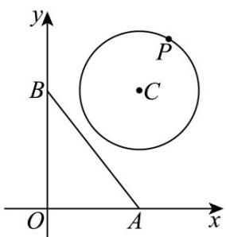

> [!faq]- 《专题04 直线与圆、圆与圆的位置关系的四大常考题型（高效培优专项训练）》官方解析
>
> > [!success]- **【答案】** A．直线 AB 与圆 C 相离 B．△PAB 的面积的最小值为 2 C．圆 C 上存在点 P 使得 $\angle APB = 90^{\circ}$ D．当 $\angle PBA$ 最小时， $|PB| = \sqrt{5}$
>
> > [!note]- **【解析】**
> > 已知 $A(3,0)$ ， $B(0,4)$ ，可得直线 $AB$ 的方程为 $\frac{x}{3} + \frac{y}{4} = 1$ ，即 $4x + 3y - 12 = 0 \cdot \text{圆 } C$ ：
> >
> > $(x-3)^{2}+(y-4)^{2}=4$ 的圆心坐标为 $C(3,4)$ ，半径 r=2。
> >
> > 根据点到直线的距离公式，可得圆心 $C(3,4)$ 到直线 $AB$ 距离 $d = \frac{|4\times 3 + 3\times 4 - 12|}{\sqrt{4^2 + 3^2}} = \frac{12}{5} >2$ ，所以直线 $AB$ 与圆 $C$ 相离，故A选项正确·
> >
> > 由 A 可知圆心 C 到直线 AB 的距离 $d=\frac{12}{5}$ ，则圆上的点 P 到直线 AB 的距离的最小值为 $d_{\min}=\frac{12}{5}-2=\frac{2}{5}$ .
> > 又 $\left|AB\right|=\sqrt{3^{2}+4^{2}}=5$ ，根据三角形面积公式可得 $\triangle PAB$ 面积的最小值为 $S_{\min}=\frac{1}{2}\times\left|AB\right|\times d_{\min}=\frac{1}{2}\times5\times\frac{2}{5}=1$ ，故 B 选项错误.
> >
> > 以 $AB$ 为直径的圆的圆心坐标为 $(\frac{3}{2}, 2)$ ，半径 $R = \frac{1}{2} |AB| = \frac{5}{2}$ .
> >
> > 两圆的圆心距 $|CC'|=\sqrt{(3-\frac{3}{2})^{2}+(4-2)^{2}}=\frac{5}{2}$ ，而 $R+r=\frac{5}{2}+2=\frac{9}{2}$ ， $|R-r|=|\frac{5}{2}-2|=\frac{1}{2}$ ，
> >
> > 因为 $\frac{1}{2} < |CC'| < \frac{9}{2}$ ，所以两圆相交，故圆 $C$ 上存在点 $P$ 使得 $\angle APB = 90^{\circ}$ ，故 $C$ 选项正确。当直线 $BP$ 为圆 $C$ 的切线时， $\angle PBA$ 可取到最值。
> >
> > 因为圆心 $C(3,4)$ ， $B(0,4)$ ，所以 $|BC|=3$ ，又圆 C 的半径 r=2，
> >
> > 根据勾股定理可得 $|PB| = \sqrt{|BC|^2 - r^2} = \sqrt{3^2 - 2^2} = \sqrt{5}$ ，故D选项正确·
> >
> > 故选：ACD.
> >
> > 
