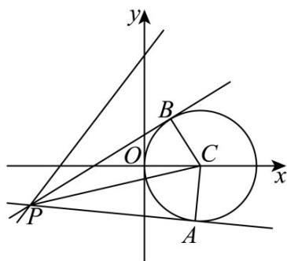

> [!faq]- 《专题04 直线与圆、圆与圆的位置关系的四大常考题型（高效培优专项训练）》官方解析
>
> > [!success]- **【答案】** B
>
> > [!note]- **【解析】**
> > 
> >
> > 如图，由 $C: x^2 + y^2 - 4x = 0$ 可得 $(x - 2)^2 + y^2 = 4$ ，则其圆心为 $C(2,0)$ ，半径 $r = 2$ .
> >
> > 因为直线与圆相切，所以 $\angle PAC = \angle PBC = 90^{\circ}$ ，且 $\triangle PAC \cong \triangle PBC$
> >
> > 则四边形 PACB 面积 $S_{PACB} = 2S_{\triangle PAC} = 2 \times \frac{1}{2} \times |AC| \times |PA| = 2 |PA|$
> >
> > 又 $|PA| = \sqrt{|PC|^2 - |AC|^2} = \sqrt{|PC|^2 - 4}$ ，则 $S_{PACB} = 2\sqrt{|PC|^2 - 4}$ .
> >
> > 故当 $|PC|$ 取最小值时，四边形PACB面积取最小值，
> >
> > 由图象可得， $|PC|$ 取得的最小值即为点 C 到直线 l:4x-3y+12=0 的距离，
> > 即 $\left|PC\right|_{\min}=\frac{\left|4\times2+12\right|}{\sqrt{3^{2}+4^{2}}}=4$
> >
> > 故四边形 PACB 面积的最小值为 $2\sqrt{|PC|_{\min}^{2}-4}=2\sqrt{4^{2}-4}=4\sqrt{3}$ .
> >
> > 故选 **B**.
