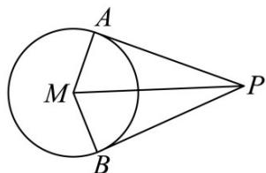

> [!faq]- 《专题04 直线与圆、圆与圆的位置关系的四大常考题型（高效培优专项训练）》官方解析
>
> > [!success]- **【答案】** $1 - \sqrt{2}$
>
> > [!note]- **【解析】**
> > 设 $|PM|=d$ ， $\angle APB=2\alpha$
> >
> > 
> >
> > 因为 PA, PB 是圆 M 的切线，所以 $MA \perp PA$ ， $MB \perp PB$ 。
> >
> > 在 $Rt\triangle PAM$ 中， $\sin \alpha = \frac{|MA|}{|PM|} = \frac{1}{d}$
> >
> > 根据向量数量积公式可得： $PA \cdot PB = |PA||PB| \cos 2\alpha$
> >
> > 由勾股定理可得 $|\overline{P}A| = \sqrt{|\overline{P}M|^2 - |\overline{M}A|^2} = \sqrt{d^2 - 1}$ ，同理 $|\overline{P}B| = \sqrt{d^2 - 1}$
> >
> > 根据二倍角公式可得 $\cos 2\alpha = 1 - 2\times (\frac{1}{d})^2 = 1 - \frac{2}{d^2}$
> >
> > 所以 $\overline{PA} \cdot \overline{PB} = (d^{2} - 1)(1 - \frac{2}{d^{2}}) = d^{2} - 1 - 2 + \frac{2}{d^{2}} = d^{2} + \frac{2}{d^{2}} - 3$ .
> >
> > 根据均值不等式有 $d^2 + \frac{2}{d^2} = 2\sqrt{d^2 \times \frac{2}{d^2}} = 2\sqrt{2}$ ，当且仅当 $d^2 = \frac{2}{d^2}$ ，即 $d^2 = \sqrt{2}$ 时等号成立。
> >
> > 所以 $\overline{PA} \cdot \overline{PB} = d^{2} + \frac{2}{d^{2}} - 3 \quad 2\sqrt{2} - 3$ ，即 $\overline{PA} \cdot \overline{PB}$ 的最小值为 $2\sqrt{2} - 3$ .
> >
> > 当 $\square PA\cdot \square PB$ 取最小值时， $d^2 = \sqrt{2}$ ，此时 $\sin \alpha = \frac{1}{d} = \frac{1}{\sqrt[4]{2}}.$
> >
> > 根据二倍角公式可得 $\cos2\alpha=1-2\times\left(\frac{1}{\sqrt[4]{2}}\right)^{2}=1-\sqrt{2}$
> >
> > 所以 $\overset{\square\square}{PA}$ 与 $\overset{\square\square}{PB}$ 夹角的余弦值为 $1-\sqrt{2}$
> >
> > 故答案为： $1-\sqrt{2}$
