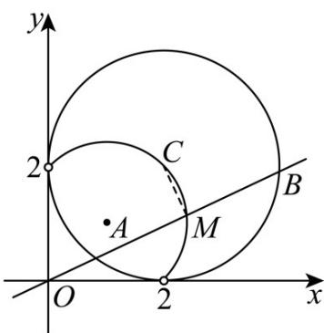

> [!faq]- 《专题04 直线与圆、圆与圆的位置关系的四大常考题型（高效培优专项训练）》官方解析
>
> > [!success]- **【答案】** BCD
>
> > [!note]- **【解析】**
> > 圆 $C:(x-a)^{2}+(y-2)^{2}=4$ 的圆心 $C(a,2)$ ，半径 r=2，
> >
> > 对于 A，当 a=1, t=0 时，点 $C(1,2)$ 到直线 x=0 的距离 d=1，则 $\left|AB\right|=2\sqrt{r^{2}-d^{2}}=2\sqrt{3}$ ，A 错误；
> > 对于 B，切线长为 $\sqrt{\left|OC\right|^{2}-r^{2}}=\left|a\right|$ ，B 正确；
> >
> > 对于 $C$ ，当 $a = 2$ 时，点 $C(2,2)$ ，令弦 $AB$ 中点为 $M$ ，则 $OM \perp AB$ ，点 $M$ 的轨迹是以 $OC$ 为直径的半圆（不含端点），轨迹长度为 $\frac{1}{2} |OC| \pi = \sqrt{2}\pi$ ， $C$ 正确；
> >
> > 
> >
> > 对于 $^{D}$ ，由 $\left\{\begin{aligned}x&=ty\\ x^{2}&=y^{2}-2ax-4y+a^{2}=0\end{aligned}\right.$ 消去 $_{x}$ 得 $(t^{2}+1)y^{2}-(2at+4)y+a^{2}=0$ ，
> >
> > 设 $A(x_{1},y_{1})B(x_{2},y_{2})$ ，则 $y_{1}y_{2}=\frac{a^{2}}{t^{2}+1}$ ， $|OA||OB|=|OA\cdot OB|=|x_{1}x_{2}+y_{1}y_{2}|=|(t^{2}+1)y_{1}y_{2}|=a^{2}$ ，D 正确。
> > 故选·BCD
