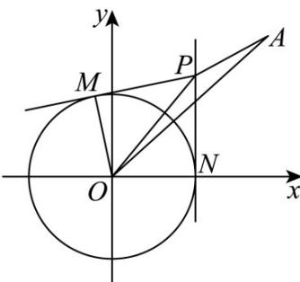

> [!faq]- 《专题04 直线与圆、圆与圆的位置关系的四大常考题型（高效培优专项训练）》官方解析
>
> > [!success]- **【答案】** $\frac{13}{5}$
>
> > [!note]- **【解析】**
> > 设 $P(x,y)$ ，连接 $\left|OM\right|$ ，则 $OM\perp PM$ ，可得 $\left|OM\right|^2 +\left|PM\right|^2 = \left|OP\right|^2$
> >
> > 所以 $|OP|^{2} = |OM|^{2} + |PM|^{2} = 1 + |PM|^{2} = 1 + |PA|^{2}$
> >
> > 即 $1 + (x - 3)^{2} + (y - 4)^{2} = x^{2} + y^{2}$ ，可得 $3x + 4y = 13$
> >
> > 所以 $|OP|$ 的最小值为点O到直线： $3x + 4y = 13$ 的距离 $d = \frac{13}{\sqrt{3^2 + 4^2}} = \frac{13}{5}$ .
> >
> > 
> >
> > 故答案为： $\frac{13}{5}$
