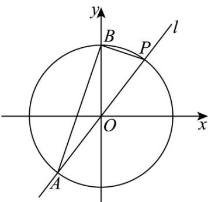

> [!faq]- 《专题04 直线与圆、圆与圆的位置关系的四大常考题型（高效培优专项训练）》官方解析
>
> > [!success]- **【答案】** (1) $3x + 4y - 25 = 0$ (2) $4x - 3y = 0$ 或 $3x - y - 5 = 0$
>
> > [!note]- **【解析】**
> > （1）由题意，点 $P(3,4)$ 在圆 $x^{2} + y^{2} = r^{2}$ 上，可得 $r = 5$ ，
> >
> > 因直线 $OP$ 的斜率为 $k_{OP} = \frac{4}{3}$ ，则圆 $O$ 在点 $P$ 处的切线斜率为 $-\frac{3}{4}$
> >
> > 故切线方程为 $y - 4 = -\frac{3}{4} (x - 3)$ ，即 $3x + 4y - 25 = 0$ ；
> >
> > (2) 如图，由 (1) 知圆 $O: x^{2} + y^{2} = 25$ ，又点 $P(3,4)$ ， $B(0,5)$
> >
> > 
> >
> > 当直线 l 的斜率不存在时，直线 l: x = 3 ，易知此时， $A(3, -4)$ ，
> >
> > 点 $B(0,5)$ 到 $l:x = 3$ 的距离为3，则 $S_{\triangle ABP} = \frac{1}{2}\times 8\times 3 = 12$ ，不符合题意；
> >
> > 当直线 $l$ 的斜率存在时，设直线 $l:y - 4 = k(x - 3)$ ，即 $kx - y + 4 - 3k = 0$
> >
> > 代入 $x^{2} + y^{2} = 25$ 中，整理得： $(k^2 +1)x^2 -(6k^2 -8k)x + 9k^2 -24k - 9 = 0$
> >
> > 设 $A(x_0, y_0)$ ，由韦达定理， $3x_0 = \frac{9k^2 - 24k - 9}{k^2 + 1}$ ，即 $x_0 = \frac{3k^2 - 8k - 3}{k^2 + 1}$ ，
> >
> > 代入 $kx - y + 4 - 3k = 0$ ，可得 $y_{0} = \frac{-4k^{2} - 6k + 4}{k^{2} + 1}$ ，即 $A(\frac{3k^2 - 8k - 3}{k^2 + 1},\frac{-4k^2 - 6k + 4}{k^2 + 1})$
> >
> > 于是 $\left|PA\right|^{2}=\left(\frac{3k^{2}-8k-3}{k^{2}+1}-3\right)^{2}+\left(\frac{-4k^{2}-6k+4}{k^{2}+1}-4\right)^{2}=\frac{(k^{2}+1)(8k+6)^{2}}{(k^{2}+1)^{2}}$
> >
> > 则得 $|PA| = \frac{|8k + 6|\sqrt{k^2 + 1}}{k^2 + 1}$
> >
> > 点 $B(0,5)$ 到直线 $l:kx - y + 4 - 3k = 0$ 的距离为： $d = \frac{|3k + 1|}{\sqrt{k^2 + 1}}$
> >
> > 则 $S_{\triangle ABP} = \frac{1}{2}\times \frac{|8k + 6|\sqrt{k^2 + 1}}{k^2 + 1}\times \frac{|3k + 1|}{\sqrt{k^2 + 1}} = 15$ ，解得 $k = \frac{4}{3}$ 或 $k = 3$
> >
> > 故直线 l 的方程为 4x - 3y = 0 或 3x - y - 5 = 0 .
