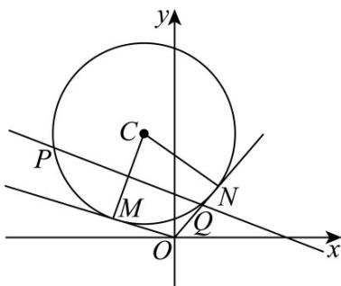

> [!faq]- 《专题04 直线与圆、圆与圆的位置关系的四大常考题型（高效培优专项训练）》官方解析
>
> > [!success]- **【答案】** (1)1 (2) $\frac{37}{8}$
>
> > [!note]- **【解析】**
> > （1）
> >
> > 
> >
> > 由圆 $x^{2} + y^{2} + x - 6y + m = 0$ 可得：
> >
> > 圆心为 $\left(-\frac{1}{2},3\right)$ ，半径 $r = \frac{\sqrt{37 - 4m}}{2}$ ，其中 $m <   \frac{37}{4}$
> >
> > 而圆心 $\left(-\frac{1}{2},3\right)$ 到直线 $x + 2y - 3 = 0$ 的距离 $d = \frac{\left| - \frac{1}{2} + 6 - 3\right|}{\sqrt{1 + 4}} = \frac{\sqrt{5}}{2}$
> >
> > 所以 $\left|PQ\right|=2\sqrt{r^{2}-d^{2}}=2\sqrt{\frac{37-4m}{4}-\frac{5}{4}}=2\sqrt{7}$ ，解得m=1，
> >
> > 即 $m$ 的值为1.
> >
> > (2) $|OC|=\sqrt{\left(\frac{1}{2}\right)^{2}+3^{2}}=\frac{\sqrt{37}}{2}$ 由(1)可知 $r=\frac{\sqrt{37-4m}}{2}$
> >
> > 由勾股定理可得 $\left|OM\right|=\sqrt{OC^{2}-r^{2}}=\sqrt{\frac{37}{4}-\frac{37-4m}{4}}=\sqrt{m}$
> >
> > 四边形 ONCM 由两个全等的直角三角形组成。所以
> >
> > $$
> > S = 2 \times \frac {1}{2} | O M | \times r = \sqrt {m} \times \frac {\sqrt {3 7 - 4 m}}{2} = \frac {\sqrt {m (3 7 - 4 m)}}{2} = \sqrt {m \left(\frac {3 7}{4} - m\right)} \leq \frac {m + \frac {3 7}{4} - m}{2} = \frac {3 7}{8},
> > $$
> >
> > 当且仅当 $m = \frac{37}{8}$ 时成立
> >
> > 所以当 $m=\frac{37}{8}$ 四边形 ONCM 有最大面积 $\frac{37}{8}$ .
