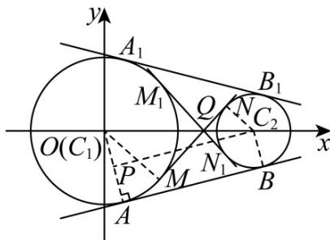

## 题型四：由圆的位置关系确定参数

31. 圆 $C_1: x^2 + y^2 = 4$ 与圆 $C_2: (x - 4)^2 + y^2 = 1$ 的一条公切线长为 \_\_\_\_（填入一个答案即可）.

【答案】 $\sqrt{15}$ 或 $\sqrt{7}$ （填一个即可）

【详解】由题意得 $C_1(0,0)$ ， $C_2(4,0)$ ， $r_1 = 2$ ， $r_2 = 1$ ， $\left|C_1C_2\right| = 4 > r_1 + r_2$ ，故两圆相离，有四条公切线．如图，

设四条公切线分别为直线 $AB$ 、直线 $A_{1}B_{1}$ 、直线 $MN$ 、直线 $M_{1}N_{1}$ ，且 $MN$ 交 $M_{1}N_{1}$ 于点 $Q$

由对称性可知 $\left|AB\right|=\left|A_{1}B_{1}\right|$ ， $\left|MN\right|=\left|M_{1}N_{1}\right|$ 。连接 $AC_{1}$ ，过 $C_{2}$ 作 $PC_{2}\perp AC_{1}$ ，垂足为 P，连接 $BC_{2}$

则四边形 $PABC_{2}$ 为矩形，所以 $\left|AB\right| = \left|PC_{2}\right| = \sqrt{\left|C_1C_2\right|^2 - \left|OP\right|^2} = \sqrt{4^2 - (2 - 1)^2} = \sqrt{15}$ 。连接 $MC_{1}, NC_{2}$

易知 $\triangle C_1MQ \sim \triangle C_2NQ$ ，所以 $\frac{|MC_1|}{|NC_2|} = \frac{|MQ|}{|NQ|} = \frac{|C_1Q|}{|C_2Q|} = 2$ 。又 $|C_1Q| + |C_2Q| = 4$ ，所以 $|C_2Q| = \frac{4}{3}$

所以在 $\mathsf{Rt}\triangle C_2NQ$ 中， $|NQ| = \sqrt{\left(\frac{4}{3}\right)^2 - 1} = \frac{\sqrt{7}}{3}$ ，所以 $|MN| = 3|NQ| = \sqrt{7}$ 。

故两圆的一条公切线长为 $\sqrt{15}$ 或 $\sqrt{7}$

故答案为： $\sqrt{15}$ 或 $\sqrt{7}$ （填一个即可）.

![[高中/课堂同步/题库/人教A版高中数学同步讲义(2026)/03_选择性必修第一册/第二章 直线和圆的方程/专题04 直线与圆、圆与圆的位置关系的四大常考题型（高效培优专项训练）/题型四_由圆的位置关系确定参数/questions/Q00080504.md]]
![[高中/课堂同步/题库/人教A版高中数学同步讲义(2026)/03_选择性必修第一册/第二章 直线和圆的方程/专题04 直线与圆、圆与圆的位置关系的四大常考题型（高效培优专项训练）/题型四_由圆的位置关系确定参数/questions/Q00080505.md]]
![[高中/课堂同步/题库/人教A版高中数学同步讲义(2026)/03_选择性必修第一册/第二章 直线和圆的方程/专题04 直线与圆、圆与圆的位置关系的四大常考题型（高效培优专项训练）/题型四_由圆的位置关系确定参数/questions/Q00080506.md]]
![[高中/课堂同步/题库/人教A版高中数学同步讲义(2026)/03_选择性必修第一册/第二章 直线和圆的方程/专题04 直线与圆、圆与圆的位置关系的四大常考题型（高效培优专项训练）/题型四_由圆的位置关系确定参数/questions/Q00080507.md]]
![[高中/课堂同步/题库/人教A版高中数学同步讲义(2026)/03_选择性必修第一册/第二章 直线和圆的方程/专题04 直线与圆、圆与圆的位置关系的四大常考题型（高效培优专项训练）/题型四_由圆的位置关系确定参数/questions/Q00080508.md]]
![[高中/课堂同步/题库/人教A版高中数学同步讲义(2026)/03_选择性必修第一册/第二章 直线和圆的方程/专题04 直线与圆、圆与圆的位置关系的四大常考题型（高效培优专项训练）/题型四_由圆的位置关系确定参数/questions/Q00080509.md]]
![[高中/课堂同步/题库/人教A版高中数学同步讲义(2026)/03_选择性必修第一册/第二章 直线和圆的方程/专题04 直线与圆、圆与圆的位置关系的四大常考题型（高效培优专项训练）/题型四_由圆的位置关系确定参数/questions/Q00080510.md]]
