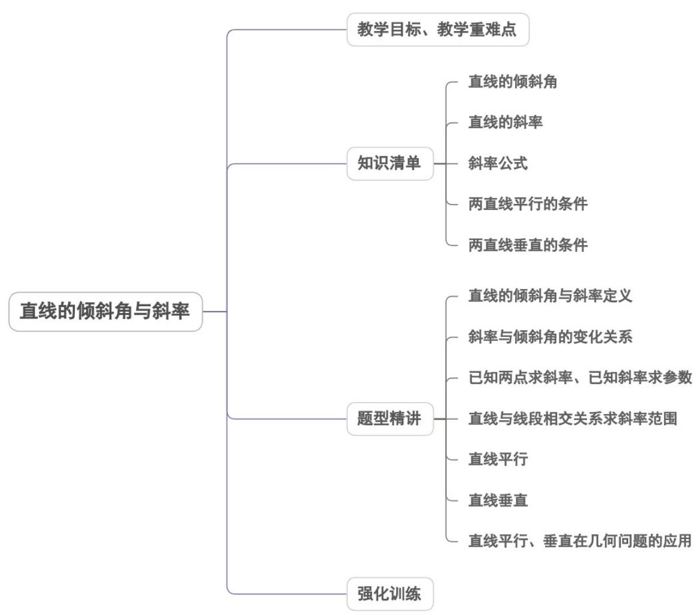

<!-- source-part:1 pages:1-45 -->

## 专题 2.1 直线的倾斜角与斜率

## 内容概览

## 教学目标、教学重难点

<table><tr><td>教学目标</td><td>1.在平面直角坐标系中,结合具体图形,探索确定直线位置的几何要素.2.理解直线的倾斜角和斜率的概念,经历用代数方法刻画直线斜率的过程,掌握过两点的直线斜率的计算公式.3.能根据斜率判定两条直线平行或垂直.</td></tr><tr><td>教学重难点</td><td>重点根据斜率判定两条直线平行或垂直.</td></tr></table>

## 知识清单

## 知识点 01 直线的倾斜角

平面直角坐标系中，对于一条与 $x$ 轴相交的直线，如果把 $x$ 轴绕着交点按逆时针方向旋转到和直线重合时所

转的最小正角记为 $\alpha$ ，则 $\alpha$ 叫做直线的倾斜角.

规定：当直线和 $x$ 轴平行或重合时，直线倾斜角为 $0^{\circ}$ ，所以，倾斜角的范围是 $0^{\circ} \leq \alpha < 180^{\circ}$

【即学即练】

1. 已知直线 l 的一个方向向量为 $l = \left(1, -\sqrt{3}\right)$ ，则直线 l 的倾斜角为（）.

【答案】
A. $\frac{\pi}{6}$ B. $\frac{\pi}{3}$ C. $\frac{2\pi}{3}$ D. $\frac{5\pi}{6}$

【答案】C

【分析】根据方向向量与直线斜率关系求斜率，再由斜率与倾斜角关系求倾斜角·

【详解】由题意，直线 $l$ 的斜率为 $-\sqrt{3}$

结合斜率与倾斜角的关系，得直线 $l$ 的倾斜角为 $\frac{2\pi}{3}$

故选：C.

2. 已知直线 $l$ 的一个方向向量为 $l = (1, -\sqrt{3})$ ，则直线 $l$ 的倾斜角为（）

【答案】

A. $\frac{\pi}{6}$ B. $\frac{\pi}{3}$ C. $\frac{2\pi}{3}$ D. $\frac{5\pi}{6}$

【答案】C

【分析】根据方向向量与直线斜率关系求斜率，再由斜率与倾斜角关系求倾斜角·

【详解】由直线方向向量为 $l = \left(1, -\sqrt{3}\right)$ ，则直线斜率为 $-\sqrt{3}$ ，结合倾斜角的范围，故其倾斜角为 $\frac{2\pi}{3}$

故选：C

## 知识点 02 直线的斜率

1. 定义：倾斜角不是 $90^{\circ}$ 的直线，它的倾斜角的正切叫做这条直线的斜率，常用 $k$ 表示，即 $k = \tan \alpha$

2．直线的倾斜角 $\alpha$ 与斜率 k 之间的关系：由斜率的定义可知，当 $\alpha$ 在 $(0^{\circ}, 90^{\circ})$ 范围内时，直线的斜率大于零；当 $\alpha$ 在 $(90^{\circ}, 180^{\circ})$ 范围内时，直线的斜率小于零；当 $\alpha = 0^{\circ}$ 时，直线的斜率为零；当 $\alpha = 90^{\circ}$ 时，直线的斜率不存在．直线的斜率与直线的倾斜角（ $90^{\circ}$ 除外）为一一对应关系，且在 $\left[0^{\circ}, 90^{\circ}\right)$ 和 $(90^{\circ}, 180^{\circ})$ 范围内分别与倾斜角的变化方向一致，即倾斜角越大则斜率越大，反之亦然．因此若需在 $\left[0^{\circ}, 90^{\circ}\right)$ 或 $(90^{\circ}, 180^{\circ})$ 范围内比较倾斜角的大小只需比较斜率的大小即可，反之亦然．

【即学即练】

1. 直线 $l$ 的一个方向向量为 $a = (1,2)$ ，倾斜角为 $\alpha$ ，则 $\tan 2\alpha = (\quad)$ A.2 B.-2 C. $\frac{4}{3}$ D. $-\frac{4}{3}$

【答案】D

【分析】先求出直线的斜率 $\tan \alpha$ ，再利用正切二倍角求出 $\tan 2\alpha$

【详解】因为直线 $l$ 的一个方向向量为 $a = (1,2)$ ，所以 $\tan \alpha = 2$

则 $\tan 2\alpha = \frac{2\tan\alpha}{1 - \tan^2\alpha} = \frac{4}{1 - 4} = -\frac{4}{3}$

故选：D

2. 若一条直线的斜率等于 $\sqrt{3}$ ，则该直线的倾斜角是（ ）A. $\frac{\pi}{6}$ B. $\frac{\pi}{4}$ C. $\frac{\pi}{3}$ D. $\frac{2\pi}{3}$

【答案】C

【分析】根据斜率和倾斜角的关系得到方程，求出答案·

【详解】设直线的倾斜角为 $\theta$ ，则 $\tan \theta = \sqrt{3}$

又 $\theta\in[0,\pi)$ ，故 $\theta=\frac{\pi}{3}$ .

故选：C

知识点 03 斜率公式

已知点 $P_{1}(x_{1},y_{1})$ 、 $P_{2}(x_{2},y_{2})$ ，且 $P_{1}P_{2}$ 与 $x$ 轴不垂直，过两点 $P_{1}(x_{1},y_{1})$ 、 $P_{2}(x_{2},y_{2})$ 的直线的斜率公式 $k = \frac{y_2 - y_1}{x_2 - x_1}$

【即学即练】

1. 若 $A(-2,3), B(3,-2), C\left(\frac{1}{2}, m\right)$ 三点在同一条直线上，则 $m$ 的值为（） A. $\frac{2}{3}$ B. $\frac{1}{2}$ C. $-\frac{1}{2}$ D. $-\frac{2}{3}$

【答案】B

【分析】由三点共线得 $k_{AB} = k_{AC}$ ，利用斜率的坐标公式建立方程求解即可·
【详解】因为 $A, B, C$ 三点在同一条直线上，且直线的斜率显然存在，
所以 $k_{AB} = k_{AC}$ ，则 $\frac{-2 - 3}{3 + 2} = \frac{m - 3}{\frac{1}{2} + 2}$ ，解得 $m = \frac{1}{2}$ 。

故选：B.

2. 若 $A(1,2), B(-1,0), C(m,3)$ 三点在同一条直线上，则实数 $m = (\quad)$ A. -4    B. -2    C. 2    D. 4

【答案】C

【分析】由三点共线得到 $k_{AB}=k_{AC}$ ，再由两点表示出直线的斜率求解即可；

【详解】由题意可得 $k_{AB} = k_{AC}$ ，即 $\frac{0 - 2}{-1 - 1} = \frac{3 - 2}{m - 1}$ ，解得 $m = 2$ ：

故选：C.

## 知识点 04 两直线平行的条件

设两条不重合的直线 $l_{1}, l_{2}$ 的斜率分别为 $k_{1}, k_{2}$ 。若 $l_{1} / / l_{2}$ ，则 $l_{1}$ 与 $l_{2}$ 的倾斜角 $\alpha_{1}$ 与 $\alpha_{2}$ 相等。由 $\alpha_{1} = \alpha_{2}$ ，可得 $\tan \alpha_{1} = \tan \alpha_{2}$ ，即 $k_{1} = k_{2}$ 。

因此，若 $l_{1} / / l_{2}$ ，则 $k_{1} = k_{2}$ .反之，若 $k_{1} = k_{2}$ ，则 $l_{1} / / l_{2}$

## 【即学即练】

1. 已知 $l_{1}$ ， $l_{2}$ 为两条不重合的直线，则下列说法中错误的为（）

【答案】

A. 若 $l_{1}$ ， $l_{2}$ 的斜率相等，则 $l_{1}$ ， $l_{2}$ 平行

B. 若 $l_{1} // l_{2}$ ，则 $l_{1}$ ， $l_{2}$ 的倾斜角相等

C. 若 $l_{1}$ ， $l_{2}$ 的斜率乘积等于-1，则 $l_{1}$ ， $l_{2}$ 垂直

D. 若 $l_{1} \perp l_{2}$ ，则 $l_{1}$ ， $l_{2}$ 的斜率乘积等于-1

【答案】D

【分析】由两直线斜率相等可得平行，选项 $^{A}$ 正确；由两直线平行可得倾斜角相等，选项 $^{B}$ 正确；由两直线斜率之积等于-1可得两直线垂直，选项 $^{C}$ 正确；当两直线垂直时，其中一条直线斜率可能不存在，选项 $^{D}$ 错

误·

【详解】根据两直线的位置关系可知若 $l_{1}$ ， $l_{2}$ 斜率相等且不重合，则 $l_{1}$ ， $l_{2}$ 平行，A正确·由 $l_{1} / / l_{2}$ ，可得 $l_{1}$ ， $l_{2}$ 的倾斜角相等，B正确·
由 $l_{1}$ ， $l_{2}$ 的斜率乘积等于-1，可得 $l_{1}$ ， $l_{2}$ 垂直，C正确·
当 $l_{1}$ 与 $x$ 轴平行， $l_{2}$ 与 $y$ 轴平行时， $l_{1} \perp l_{2}$ ，但直线 $l_{1}$ 的斜率不存在，D错误·

故选：D.

2. 若 $a \in \mathbf{R}$ ，直线 $l_{1}: x + 2ay - 1 = 0$ ，直线 $l_{2}: (3a - 1)x - ay - 1 = 0$ ，则“ $l_{1} \parallel l_{2}$ ”的充分不必要条件是（）A. $a = 0$ B. $a = -\frac{1}{6}$ C. $a = 1$ D. $a = \frac{1}{2}$

【答案】A

【分析】由题可得 $l_{1}\parallel l_{2}$ 的充要条件，据此可得答案·

【详解】因 $l_{1}\parallel l_{2}$ ，则 $-a=2a(3a-1)\Rightarrow6a^{2}-a=0\Rightarrow a=0$ 或 $a=\frac{1}{6}$ .

当 $a = 0$ ， $l_{1}: x - 1 = 0$ ， $l_{2}: -x - 1 = 0$ ，两直线平行，满足题意；

当 $a=\frac{1}{6}$ ， $l_{1}:x+\frac{1}{3}y-1=0\Leftrightarrow3x+y-3=0$ ， $l_{2}:-\frac{1}{2}x-\frac{1}{6}y-1=0\Leftrightarrow3x+y+6=0$ ，满足题意

则 $l_{1} \parallel l_{2}$ 的充要条件为 $a = \frac{1}{6}$ 或 a = 0 .

则“ $l_{1}\parallel l_{2}$ ”的充分不必要条件可以是 $a=\frac{1}{6}$ ，也可以是 a=0。

故选：A

## 知识点 05 两直线垂直的条件

设两条直线 $l_{1}, l_{2}$ 的斜率分别为 $k_{1}, k_{2}$ . 若 $l_{1} \perp l_{2}$ , 则 $k_{1} \cdot k_{2} = -1$ .

【即学即练】

1. 以 $A(-1,1), B(2,-1), C(3,7)$ 为顶点的三角形是（）

【答案】

A. 锐角三角形 B. 直角三角形 C. 钝角三角形 D. 等边三角形

【答案】B

【分析】求出直线 AB 和 AC 的斜率，判断出 $AB \perp AC$ ，进而可得结果.

【详解】因为 $k_{AB}=\frac{-1-1}{2-(-1)}=-\frac{2}{3},k_{AC}=\frac{7-1}{3-(-1)}=\frac{3}{2}$

所以 $k_{AB} \cdot k_{AC} = -1$ ，

故 $AB \perp AC$

因此该三角形为直角三角形·

故选：B.

2. 已知直线 $m$ 与直线 $n: y = \sqrt{3}x$ 垂直，则直线 $m$ 的倾斜角为（）A. $\frac{\pi}{6}$ B. $\frac{\pi}{3}$ C. $\frac{2\pi}{3}$ D. $\frac{5\pi}{6}$

【答案】D

【分析】根据垂直关系得到直线 m 的斜率，进而得到倾斜角·

【详解】由题意，直线 $n$ 的斜率为 $\sqrt{3}$ ，因为直线 $m$ 与直线 $n$ 垂直，所以直线 $m$ 的斜率为 $-\frac{\sqrt{3}}{3}$

结合斜率与倾斜角的关系，得直线 $m$ 的倾斜角为 $\frac{5\pi}{6}$

故选：D.

## 题型精讲

![[高中/课堂同步/题库/人教A版高中数学同步讲义(2026)/03_选择性必修第一册/第二章 直线和圆的方程/专题2.1 直线的倾斜角与斜率（高效培优讲义）/题型01_直线的倾斜角与斜率定义/题型01_直线的倾斜角与斜率定义.md]]
![[高中/课堂同步/题库/人教A版高中数学同步讲义(2026)/03_选择性必修第一册/第二章 直线和圆的方程/专题2.1 直线的倾斜角与斜率（高效培优讲义）/题型02_斜率与倾斜角的变化关系/题型02_斜率与倾斜角的变化关系.md]]
![[高中/课堂同步/题库/人教A版高中数学同步讲义(2026)/03_选择性必修第一册/第二章 直线和圆的方程/专题2.1 直线的倾斜角与斜率（高效培优讲义）/题型03_已知两点求斜率_已知斜率求参数/题型03_已知两点求斜率_已知斜率求参数.md]]
![[高中/课堂同步/题库/人教A版高中数学同步讲义(2026)/03_选择性必修第一册/第二章 直线和圆的方程/专题2.1 直线的倾斜角与斜率（高效培优讲义）/题型05_直线平行/题型05_直线平行.md]]
![[高中/课堂同步/题库/人教A版高中数学同步讲义(2026)/03_选择性必修第一册/第二章 直线和圆的方程/专题2.1 直线的倾斜角与斜率（高效培优讲义）/题型06_直线垂直/题型06_直线垂直.md]]
![[高中/课堂同步/题库/人教A版高中数学同步讲义(2026)/03_选择性必修第一册/第二章 直线和圆的方程/专题2.1 直线的倾斜角与斜率（高效培优讲义）/题型07_直线平行_垂直在几何问题的应用/题型07_直线平行_垂直在几何问题的应用.md]]
![[高中/课堂同步/题库/人教A版高中数学同步讲义(2026)/03_选择性必修第一册/第二章 直线和圆的方程/专题2.1 直线的倾斜角与斜率（高效培优讲义）/强化训练/强化训练.md]]
