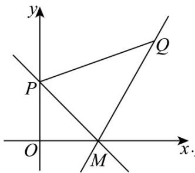

> [!faq]- 《专题2.1 直线的倾斜角与斜率（高效培优讲义）》官方解析
>
> > [!success]- **【答案】** C
>
> > [!note]- **【分析】**
> > 根据题意作出相应图形，利用两点斜率公式求得两临界斜率，再数形结合即可得解·【详解】点 $M(1,0), P(0,1), Q(2,\sqrt{3})$ ，过 $M$ 的直线 $l$ （不垂直于 $x$ 轴）与线段 $PQ$ 相交，如图，
>
> > [!note]- **【解析】**
> > 
> > $$
> > k _ {M Q} = \frac {\sqrt {3}}{2 - 1} = \sqrt {3}, k _ {M P} = \frac {1 - 0}{0 - 1} = - 1
> > $$
> > 且过 $M$ 的直线 $l$ （不垂直于 $x$ 轴）与线段 $PQ$ 相交，
> > 直线 $MQ$ 需绕点 $M$ 逆时针旋转至倾斜角为 $90^{\circ}$ （不含 $90^{\circ}$ ），此时斜率范围为 $\left[\sqrt{3}, +\infty\right)$
> > 直线 $MP$ 需绕点 $M$ 顺时针旋转至倾斜角为 $90^{\circ}$ （不含 $90^{\circ}$ ），此时斜率范围为 $\left(-\infty, -1\right]$
> > 综上所述，直线 $l$ 斜率的取值范围是 $\left(-\infty, -1\right] \cup \left[\sqrt{3}, +\infty\right)$
> >
> > 故选 **C**.
