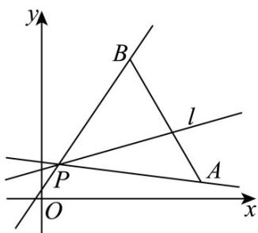

> [!faq]- 《专题2.1 直线的倾斜角与斜率（高效培优讲义）》官方解析
>
> > [!success]- **【答案】** B
>
> > [!note]- **【分析】**
> > 由题意作图，利用斜率的计算公式，可得答案·
>
> > [!note]- **【解析】**
> > 由题意作图如下：
> >
> > 
> >
> > 设直线 $AP$ 的斜率为 $k_{AP}$ ，直线 $BP$ 的斜率为 $k_{BP}$ ，直线 $l$ 的斜率为 $k_l$
> >
> > 由图可知 $k_{AP} \leq k_l \leq k_{BP}$
> >
> > 由 $A(9,1)$ ， $B(5,8)$ ， $P(1,2)$ ，则 $k_{AP} = \frac{1 - 2}{9 - 1} = -\frac{1}{8}$ ， $k_{BP} = \frac{8 - 2}{5 - 1} = \frac{6}{4} = \frac{3}{2}$
> >
> > 所以 $-\frac{1}{8} \leq k_{l} \leq \frac{3}{2}$ .
> >
> > 故选 **B**.
