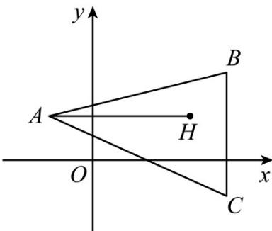

> [!faq]- 《专题2.1 直线的倾斜角与斜率（高效培优讲义）》官方解析
>
> > [!success]- **【答案】** D
>
> > [!note]- **【分析】**
> > 先设点 C 的坐标·再求出直线 BH, AH 的斜率，则可求出直线 AC 的斜率和直线 BC 的倾斜角，联立
> >
> > 方程组求出 C 的坐标；
>
> > [!note]- **【解析】**
> > 设 C 点标为 $(x, y)$ ，直线 AH 斜率 $k_{AH} = \frac{2 - 2}{5 + 2} = 0$ ，
> >
> > 
> >
> > $\therefore BC \perp AH$ ，而点 $B$ 的横坐标为 6，则 $x = 6$
> >
> > 直线 $BH$ 的斜率 $k_{BH} = \frac{4 - 2}{6 - 5} = 2$
> >
> > ∴直线AC斜率 $k_{AC}=\frac{y-2}{6+2}=-\frac{1}{2}$
> >
> > $$
> > \therefore y = - 2
> > $$
> >
> > ∴点 C 的坐标为 $(6,-2)$
> >
> > 故选 **D**·
