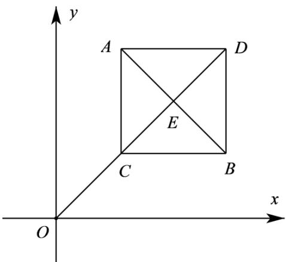

> [!faq]- 《专题2.1 直线的倾斜角与斜率（高效培优讲义）》官方解析
>
> > [!success]- **【答案】** $2+\sqrt{3}/\sqrt{3}+2$ .
>
> > [!note]- **【分析】**
> > 如图建立平面直角坐标系，设 $A(x,b),B(a,y),C(x,y),D(a,b)$ ，由已知条件可得 $OA = AB = OB = CD$
> >
> > $OC \perp AB$ ，可得四边形 $ABCD$ 为正方形，设 $x = y = 1, CE = t, \sqrt{2} + t = \sqrt{3}t$ ，从而可求出 $t$ ，进而可求得答案
>
> > [!note]- **【解析】**
> > 设 $A(x,b),B(a,y),C(x,y),D(a,b)$
> >
> > 则四边形 ABCD 为矩形，
> >
> > 因为 $(x-a)^{2}+(y-b)^{2}=x^{2}+b^{2}=a^{2}+y^{2}$
> >
> > 所以 OA = AB = OB = CD
> >
> > 而 $by - y^{2} = ax - x^{2}$ ，即 $\frac{y}{x}\cdot \frac{b - y}{x - a} = -1$ ，即 $k_{OC}\cdot k_{AB} = -1$
> >
> > 所以 $OC \perp AB$ ，又 $\triangle OAB$ 是等边三角形，所以 $OC$ 过 $AB$ 的中点，
> >
> > 所以矩形 ABCD 为正方形，由整个图形的对称性可知 a = b, x = y.
> >
> > 设 $x = y = 1, CE = t, \sqrt{2} + t = \sqrt{3}t$ ，得 $t = \frac{\sqrt{6} + \sqrt{2}}{2}$
> >
> > $$
> > B C = \sqrt {2} t = 1 + \sqrt {3}, (a, b) = (2 + \sqrt {3}, 2 + \sqrt {3}), (x, y) = (1, 1)
> > $$
> >
> > 所以 $\frac{a+b}{x+y}=2+\sqrt{3}$
> >
> > 故答案为： $2 + \sqrt{3}$
> >
> > 
