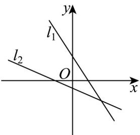
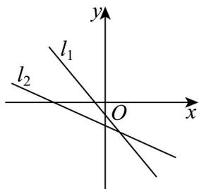
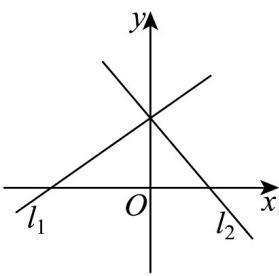
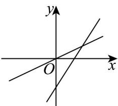
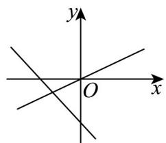

<!-- source-part:1 pages:1-50 -->

## 专题2.2 直线的方程

内容概览

教学目标、教学重难点

<table><tr><td>教学目标</td><td>根据确定直线位置的几何要素,探索并掌握直线方程的几种形式(点斜式、两点式及一般式),体会斜截式与一次函数的关系.</td></tr><tr><td>教学重难点</td><td>重点掌握直线方程的几种形式.</td></tr></table>

## 知识清单

## 知识点 01 直线的点斜式方程

方程 $y - y_0 = k(x - x_0)$ 由直线上一定点及其斜率决定，我们把 $y - y_0 = k(x - x_0)$ 叫做直线的点斜式方程，简称

点斜式.

## 【即学即练】

1. 已知 $\forall ABC$ 的三个顶点分别为 $A(4,0), B(6,-7), C(4,-3)$ ，则 $BC$ 边上的中线所在直线的方程是（） $\mathrm{A} x + y = 0 \quad \mathrm{B} x + y - 4 = 0 \quad \mathrm{C} 5x + y - 12 = 0 \quad \mathrm{D} 5x + y - 20 = 0$

【答案】D

【分析】由中点坐标公式可得 $BC$ 边的中点坐标为 $D(5, -5)$ ，可得 $BC$ 边上的中线的斜率 $k_{AD} = -5$ ，由点斜式

可得 BC 边上的中线所在直线的方程.

【详解】因为 $B(6, -7), C(4, -3)$

设 $BC$ 边的中点为 $D$ ，则 $D\left(\frac{6 + 4}{2},\frac{-7 - 3}{2}\right)$ ，即 $D(5, - 5)$

又 $A(4,0)$ ，所以 $k_{AD} = \frac{-5 - 0}{5 - 4} = -5$

故 $BC$ 边上的中线所在直线的方程为 $y - 0 = -5(x - 4)$ ，即 $5x + y - 20 = 0$

故选：D.

2. 已知直线 $l_{1}: y = x - 1$ 绕点 $(0, -1)$ 逆时针旋转 $\frac{5}{12}\pi$ ，得到直线 $l_{2}$ ，则 $l_{2}$ 不过第（）象限。

A. 四 B. 三 C. 二 D. 一

【答案】D

【分析】首先求出直线 $l_{1}$ 的倾斜角，再根据旋转角度求出直线 $l_{2}$ 的倾斜角，进而得到直线 $l_{2}$ 的斜率，再根据直

线所过的点求出直线方程，从而判断直线不过第几象限·

【详解】对于直线 $y = kx + b$ （ $k$ 为斜率），直线 $l_{1}: y = x - 1$ ，其斜率 $k_{1} = 1$ ，设其倾斜角为 $\alpha_{1}$ ，根据 $k = \tan \alpha$ ，

可得 $\tan\alpha_{1}=1$ ，又因为倾斜角 $\alpha\in[0,\pi)$ ，所以 $\alpha_{1}=\frac{\pi}{4}$

直线 $l_{1}$ 绕点 $(0,-1)$ 逆时针旋转 $\frac{5}{12}\pi$ ，则直线 $l_{2}$ 的倾斜角 $\alpha_{2}=\frac{\pi}{4}+\frac{5}{12}\pi=\frac{2\pi}{3}$

直线 $l_{2}$ 的斜率 $k_{2}=\tan\alpha_{2}=\tan\frac{2\pi}{3}=-\sqrt{3}$

因为直线 $l_{2}$ 过点 $(0, - 1)$ ，根据直线的点斜式方程 $y - y_0 = k(x - x_0)$ （ $(x_0,y_0)$ 为直线上一点， $k$ 为斜率），可得

直线 $l_{2}$ 的方程为 $y+1=-\sqrt{3}x$ ，即 $y=-\sqrt{3}x-1$ 。

直线 $y = -\sqrt{3}x - 1$ 的斜率为负，截距为负，所以直线 $l_{2}$ 不过第一象限.

故选：D.

## 知识点 02 直线的斜截式方程

如果直线 $l$ 的斜率为 $k$ ，且与 $y$ 轴的交点为 $(0,b)$ ，根据直线的点斜式方程可得 $y - b = k(x - 0)$ ，即 $y = kx + b$

我们把直线 $l$ 与 $y$ 轴的交点 $(0,b)$ 的纵坐标 $b$ 叫做直线 $l$ 在 $y$ 轴上的截距，方程 $y = kx + b$ 由直线的斜率 $k$ 与它

在 $y$ 轴上的截距 $b$ 确定，所以方程 $y = kx + b$ 叫做直线的斜截式方程，简称斜截式.

【即学即练】

1. 在同一平面直角坐标系中，直线 $l_{1}: y = kx + b$ 和直线 $l_{2}: y = bx + k$ 有可能是（）

【答案】

A

B

C

D

【答案】B

【分析】根据每个选项中 $l_{1}$ 与 $l_{2}$ 的图象，分别确定k,b的取值即可判断.

【详解】对于 $\mathsf{A}$ ，直线 $l_{1}:y = kx + b$ 单调递减， $l_{1}$ 与 $y$ 轴交于正半轴，则 $k <   0,b > 0$

直线 $l_{2}: y = bx + k$ 单调递减， $l_{2}$ 与 y 轴交于负半轴，则 b < 0, k < 0，不成立，故 A 错误；

对于 B，直线 $l_{1}: y = kx + b$ 单调递减， $l_{1}$ 与 y 轴交于负半轴，则 k < 0, b < 0

直线 $l_{2}: y = bx + k$ 单调递减， $l_{2}$ 与 y 轴交于负半轴，则 b < 0, k < 0 ，成立，故 B 正确；

对于 $\mathbb{C}$ ，直线 $l_{1}:y = kx + b$ 单调递增， $l_{1}$ 与 $y$ 轴交于负半轴，则 $k > 0,b <   0$

直线 $l_{2}: y = bx + k$ 单调递增， $l_{2}$ 与 y 轴交于正半轴，则 b > 0, k > 0 ，不成立，故 C 错误；

对于 D，直线 $l_{1}: y = kx + b$ 单调递增， $l_{1}$ 与 y 轴交于正半轴，则 k > 0, b > 0

直线 $l_{2}: y = bx + k$ 单调递减， $l_{2}$ 与 y 轴交于正半轴，则 b < 0, k > 0 ，不成立，故 D 错误；

故选：B.

2. 如图，在同一直角坐标系中，表示直线 $y = x + a$ 与 $y = ax$ 正确的是（）

【答案】

A

B

C

D

【答案】C

【分析】由 $y = x + a$ 与 y = ax 中 a 同号，分类讨论 y = ax 递增与 y = ax 递减，得到结果.

【详解】当 $a > 0$ 时，直线 $y = ax$ 过原点，且单调递增，

直线 $y = x + a$ 单调递增，且纵截距为正数，

没有符合的图象。

当 a < 0 时，直线 y = ax 过原点，且单调递减，

直线 $y = x + a$ 单调递增，且纵截距为负数，

C 选项符合.

故选：C

## 知识点 03 直线的两点式方程

经过两点 $P_{1}(x_{1},y_{1}),P_{2}(x_{2},y_{2})$ （其中 $x_{1}\neq x_{2},y_{1}\neq y_{2}$ ）的直线方程为 $\frac{y - y_1}{y_2 - y_1} = \frac{x - x_1}{x_2 - x_1} (x_1\neq x_2,y_1\neq y_2)$ ，称这个方

程为直线的两点式方程，简称两点式。

【即学即练】

1. 已知直线 $l_{1}: y = 2x - 1$ 过点 $A(-2, b)$ ，若直线 $l_{2}$ 过点 $B(6, 3)$ 及点 A 关于坐标原点的对称点，则直线 $l_{2}$ 的方程为（）

【答案】

A. $x + 2y - 12 = 0$ B. $x + 2y + 12 = 0$ C. $x - 2y = 0$ D. $2x - y = 0$

【答案】A

【分析】计算出 A 点及 A 点关于坐标原点的对称点 $A'$ 的坐标，然后由两点式求解即可·

【详解】因为直线 $l_{1}$ 过点 $A(-2, b)$ ，代入得 $b = -5$ ，即 $A(-2, -5)$

则点 A 关于坐标原点的对称点为 $A'(2,5)$ .

又直线 $l_{2}$ 过 $B, A'$ 两点，

所以直线 $l_{2}$ 的方程为 $\frac{y-3}{5-3}=\frac{x-6}{2-6}$ ，

即 $x + 2y - 12 = 0$

故选：A.

2．若过点 $P(3,2)$ 的直线l与坐标轴交于A,B两点，围成三角形AOB的面积为 $^{16}$ ，则符合条件的直线的条数为（）

【答案】
A. 1 B. 2 C. 3 D. 4

【答案】D

【分析】由题意可设直线的方程为： $\frac{x}{a}+\frac{y}{b}=1$ ，则满足关系式 $\left\{\begin{aligned}\frac{3}{a}+\frac{2}{b}&=1\\ \frac{1}{2}|ab|=16&3b^{2}-32|b-2|=0\end{aligned}\right.$ ，化简得，对

b 进行分类讨论即可求解·

【详解】由题意直线 l 显然不过原点，所以不妨设直线 $l: \frac{x}{a} + \frac{y}{b} = 1$ ， $A(a,0), B(0,b)$ ，

又点 $P(3,2)$ 在直线 $l$ 上，所以 $\frac{3}{a} +\frac{2}{b} = 1$ ， $\left|\frac{3}{a}\right| = \left|1 - \frac{2}{b}\right| = \left|\frac{b - 2}{b}\right|$

又三角形 $AOB$ 的面积为 $^{16}$ ，所以 $\frac{1}{2} |ab| = 16$ ， $\left|\frac{3}{a}\right| = \frac{3|b|}{32}$

所以 $\left|\frac{b-2}{b}\right|=\frac{3|b|}{32}$ ，整理得 $3b^{2}-32|b-2|=0$ ；

当 $b$ 2时，方程 $3b^{2} - 32|b - 2| = 0$ 变为 $3b^{2} - 32b + 64 = 0$ ，解得 $b_{1} = \frac{8}{3}$ 2或 $b_{2} = 8$ 2满足题意，

将 $b_{1} = \frac{8}{3}$ 和 $b_{2} = 8$ 分别代入 $\frac{3}{a} +\frac{2}{b} = 1$ ，解得对应的 $a$ 分别为 $a_1 = 12,a_2 = 4$

当 $b < 2$ 时，方程 $3b^{2} - 32|b - 2| = 0$ 变为 $3b^{2} + 32b - 64 = 0$ ，解得 $b_{3} = \frac{-16 - 8\sqrt{7}}{3} < 2$ 或 $b_{4} = \frac{-16 + 8\sqrt{7}}{3} < 2$ 满足题

意，

将 $b_{3}=\frac{-16-8\sqrt{7}}{3}$ 和 $b_{4}=\frac{-16+8\sqrt{7}}{3}$ 分别代入 $\frac{3}{a}+\frac{2}{b}=1$ ，解得对应的a分别为 $a_{3}=-8+4\sqrt{7},a_{4}=-8-4\sqrt{7}$

综上所述：满足题意的直线为： $\frac{x}{a_i} +\frac{y}{b_i} = 1,i\in \{1,2,3,4\}$ ，共有4条·

故选：D.

## 知识点 04 直线的截距式方程

若直线 l 与 x 轴的交点为 $A(a,0)$ ，与 y 轴的交点为 $B(0,b)$ ，其中 $a \neq 0, b \neq 0$ ，则过 AB 两点的直线方程为 $\frac{x}{a}+\frac{y}{b}=1$ ，这个方程称为直线的截距式方程。a 叫做直线在 x 轴上的截距，b 叫做直线在 y 轴上的截距。

【即学即练】

1. 已知直线 $(a+2)x-y+2a-3=0$ 在 x 轴上的截距是 y 轴上截距的 2 倍，则 a 的值为（）

【答案】
A. $\frac{3}{2}$ B. $-\frac{5}{2}$ C. $\frac{3}{2}$ 或 $-\frac{5}{2}$ D. $-\frac{1}{2}$

【答案】C

【分析】依题意可得 $a \neq -2$ ，分 $a = \frac{3}{2}$ 和 $a \neq \frac{3}{2}$ 两种情况讨论即可，求出直线 $l$ 在两坐标轴上的截距，结合题意可得出关于实数 $a$ 的等式，解之即可·

【详解】依题意可得 $a \neq -2$

当 $a = \frac{3}{2}$ 时，直线 $l$ 为 $\frac{7}{2} x - y = 0$ ，此时横纵截距都等于0，满足题意；

当 $a \neq \frac{3}{2}$ 时，将直线 $l$ 的方程化为截距式方程可得 $\frac{x}{\frac{3 - 2a}{a + 2}} + \frac{y}{2a - 3} = 1$ 直线 $l$ 在 $x$ 轴上的截距为 $\frac{3 - 2a}{a + 2}$ ，在 $y$ 轴上截距 $2a - 3$ 则 $\frac{3 - 2a}{a + 2} = 2 \times (2a - 3)$ ，得 $a = -\frac{5}{2}$ 或 $a = \frac{3}{2}$ （舍去）综上所述， $a$ 的值为 $-\frac{5}{2}$ 或 $\frac{3}{2}$ .

故选：C.

2. 过点 $A(1,4)$ 的直线在两坐标轴上的截距之和为零，则该直线方程为（ ）

【答案】
A. $x - y + 3 = 0$ B. $x + y - 5 = 0$ C. $4x - y = 0$ 或 $x + y - 5 = 0$ D. $4x - y = 0$ 或 $x - y + 3 = 0$

【答案】D

【分析】分直线过原点和不过原点两种情况讨论，结合直线的截距式即可得解
【详解】当直线过原点时在两坐标轴上的截距都为0，满足题意，
又因为直线过点 $A(1,4)$ ，所以直线的斜率为 $\frac{4-0}{1-0}=4$ 所以直线方程为 y = 4x，即 4x - y = 0，
当直线不过原点时，设直线方程为 $\frac{x}{a} + \frac{y}{-a} = 1$ 因为点 $A(1,4)$ 在直线上，
所以 $\frac{1}{a}+\frac{4}{-a}=1$ ，解得 a=-3，

所以直线方程为 $x - y + 3 = 0$ ，

故所求直线方程为 $4x - y = 0$ 或 $x - y + 3 = 0$ 故D项正确.

故选：D

## 知识点 05 直线方程几种表达方式的选取

在一般情况下，使用斜截式比较方便，这是因为斜截式只需要两个独立变数，而点斜式需要三个独立变数．
在求直线方程时，要根据给出的条件采用适当的形式．一般地，已知一点的坐标，求过这点的直线，通常采
用点斜式，再由其他条件确定斜率；已知直线的斜率，常用斜截式，再由其他条件确定在 y 轴上的截距；已
知截距或两点选择截距式或两点式．从结论上看，若求直线与坐标轴所围成的三角形的面积或周长，则选择
截距式求解较方便，但不论选用哪一种形式，都要注意各自的限制条件，以免遗漏．

## 【即学即练】

1.1．过点 $P(1,2)$ 且斜率小于 0 的直线与 x 轴，y 轴围成的封闭图形面积的最小值为（）

【答案】
A. 2 B. $2\sqrt{2}$ C. 4 D. $4\sqrt{2}$

【答案】C

【分析】设直线为 $y = kx + b (k < 0)$ ，代入 $P(1,2)$ 得 $2 = k + b$ ，表示出所围成封闭图形面积为 $S = -\frac{2}{k} - \frac{k}{2} + 2$

进而结合基本不等式求解即可·

【详解】设直线为 $y = kx + b (k < 0)$ ，代入 $P(1,2)$ 得 $2 = k + b$

即 $b = 2 - k$ ， $b > 0$

设直线与 $x$ 轴交点 $A\left(-\frac{b}{k},0\right)$ ，与 $y$ 轴交点 $B(0,b)$

则所围成封闭图形面积为 $S = \frac{1}{2}\cdot \left| - \frac{b}{k}\right|\cdot |b| = -\frac{b^2}{2k} = -\frac{(2 - k)^2}{2k} = -\frac{2}{k} -\frac{k}{2} +2$

$$
2 \sqrt {\left(- \frac {2}{k}\right) \cdot \left(- \frac {k}{2}\right)} + 2 = 4
$$

当且仅当 $-\frac{2}{k}=-\frac{k}{2}$ ，即k=-2时等号成立，

所以所围成封闭图形面积的最小值为 4.

故选：C.

2. $\forall ABC$ 中， $A(-5,0)$ ， $B(3,2)$ ， $C$ 点在 $y$ 轴上，若 $AB$ 边上的中线 $CD$ 也是 $AB$ 边上的高，则直线 $CD$ 的方程为（）

【答案】
A. $x + 4y + 3 = 0$ B. $4x + y + 3 = 0$ C. $x - 4y + 5 = 0$ D. $4x - y + 5 = 0$

【答案】B

【分析】利用中点坐标公式得 $D(-1,1)$ ，根据两直线垂直斜率之积等于-1可得 $k_{CD}$ ，然后利用点斜式即可得

【详解】由题意，得 $D$ 是 $AB$ 的中点，则 $D(-1,1)$ ，且 $AB \perp CD$ ，

又 $k_{AB} = \frac{2 - 0}{3 - (-5)} = \frac{1}{4}$ ，则 $k_{CD} = -\frac{1}{k_{AB}} = -4$

则直线 CD 的方程为 $y-1=-4(x+1)$ ，即 $4x+y+3=0$ .

故选：B

## 知识点 06 直线方程的一般式

关于 $x$ 和 $y$ 的一次方程都表示一条直线．我们把方程写为 $Ax + By + C = 0$ ，这个方程（其中 $A$ 、 $B$ 不全为零）

叫做直线方程的一般式.

【即学即练】

1. 若直线 $l_{1}: x + y - 1 = 0$ ， $l_{1} \perp l_{2}$ ，则下列向量可以作为直线 $l_{2}$ 的方向向量的是（）A. (1, -1) B. (1, 1) C. (1, 2) D. (1, -2)

【答案】B

【分析】取 $AB = (-1, 1)$ 作为 $l_{1}$ 的一个方向向量，设 $PQ = (m, n)$ 为 $l_{2}$ 的方向向量，可得 $m = n$ ，由此可得正确答

案·

【详解】取 $l_{1}$ 上两点 $A(1,0)$ ， $B(0,1)$ ，则 $AB = (-1,1)$ 可以作为 $l_{1}$ 的一个方向向量。

设 $PQ = (m, n)$ 为 $l_{2}$ 的方向向量，

$\therefore l_{1} \perp l_{2}, \therefore AB \cdot PQ = 0$ ，故 $-m + n = 0$ ，即 $m = n$ ，B选项正确。

故选：B.

2. 直线 $x - y + 2 = 0$ 的倾斜角为（ ）A. $\frac{\pi}{6}$ B. $\frac{\pi}{4}$ C. $\frac{\pi}{3}$ D. $\frac{3\pi}{4}$

【答案】B

【分析】先将给定直线方程转化为斜截式方程，从而得到直线的斜率，再根据倾斜角与斜率的关系以及倾斜

角的取值范围求出倾斜角·

【详解】对于直线方程 $x - y + 2 = 0$ ，得到 $y = x + 2$ ，斜率 $k = 1$

设直线的倾斜角为 $\theta$ ， $\theta \in [0, \pi)$ ，根据直线倾斜角与斜率的关系 $k = \tan \theta$

已知斜率 k = 1 ，所以 $\tan\theta = 1$ .

在 $\theta \in [0,\pi)$ 这个范围内，正切值等于1的角只有 $\frac{\pi}{4}$ ，所以 $\theta = \frac{\pi}{4}$

故选：B.

## 知识点 07 直线方程的不同形式间的关系

直线方程的五种形式的比较如下表：

<table><tr><td>名称</td><td>方程的形式</td><td>常数的几何意义</td><td>适用范围</td></tr><tr><td>点斜式</td><td> $y - y_1 = k(x - x_1)$ </td><td> $(x_1, y_1)$ 是直线上一定点, $k$ 是斜率</td><td>不垂直于 $x$ 轴</td></tr><tr><td>斜截式</td><td> $y = kx + b$ </td><td> $k$ 是斜率, $b$ 是直线在 $y$ 轴上的截距</td><td>不垂直于 $x$ 轴</td></tr><tr><td>两点式</td><td> $\frac{y - y_1}{y_2 - y_1} = \frac{x - x_1}{x_2 - x_1}$ </td><td> $(x_1, y_1), (x_2, y_2)$ 是直线上两定点</td><td>不垂直于 $x$ 轴和 $y$ 轴</td></tr><tr><td>截距式</td><td> $\frac{x}{a} + \frac{y}{b} = 1$ </td><td> $a$ 是直线在 $x$ 轴上的非零截距, $b$ 是直线在 $y$ 轴上的非零截距</td><td>不垂直于 $x$ 轴和 $y$ 轴,且不过原点</td></tr><tr><td>一般式</td><td> $Ax + By + C = 0 (A^2 + B^2 \neq 0)$ </td><td> $A$ 、 $B$ 、 $C$ 为系数</td><td>任何位置的直线</td></tr></table>

【即学即练】

1. 直线 $l$ 过点 $(1,2)$ ，且纵截距为横截距的两倍，则直线 $l$ 的方程是（ ）A. $2x - y = 0$ B. $2x + y - 4 = 0$

C. $2x - y = 0$ 或 $2x + y - 4 = 0$ D. $2x - y = 0$ 或 $2x + y - 2 = 0$

【答案】C

【分析】当直线 $l$ 过原点时，可求得直线斜率，进而得到直线方程·当直线不过原点时，设直线的截距式方程，

代入点坐标可得结果·

【详解】当直线 l 过原点时，直线斜率为 $\frac{2-0}{1-0}=2$ ，直线方程为 y=2x，整理得 $2x-y=0\cdot$

当直线 l 不过原点时，设直线方程为 $\frac{x}{a} + \frac{y}{2a} = 1$ ，代入 $(1, 2)$ 得， $\frac{2}{a} = 1$ ，解得 a = 2，直线方程为 $\frac{x}{2} + \frac{y}{4} = 1$ ，整理得 $2x + y - 4 = 0$ 。

综上得，直线 l 的方程为 2x - y = 0 或 $2x + y - 4 = 0$ .

故选：C.

2. 直线 $x - y + m = 0$ 的倾斜角为（）A. $\frac{\pi}{6}$ B. $\frac{\pi}{4}$ C. $\frac{\pi}{3}$ D. $\frac{3\pi}{4}$

【答案】B

【分析】将直线的一般式改成斜截式，根据倾斜角和斜率的关系，即可求出结果

【详解】根据题意可知直线 $x - y + m = 0$ 可可变形为 $y = x + m$

故直线 $x - y + m = 0$ 的斜率为 1，

设直线 $x - y + m = 0$ 倾斜角为 $\theta$

由 $\tan\theta=1$ 可得 $\theta=\frac{\pi}{4}$ .

故选：B

## 知识点 08 直线方程的综合应用

1. 已知所求曲线是直线时，用待定系数法求。

2．根据题目所给条件，选择适当的直线方程的形式，求出直线方程.

对于两直线的平行与垂直，直线方程的形式不同，考虑的方向也不同。

(1) 从斜截式考虑已知直线 $l_{1}: y = k_{1}x + b_{1}$ ， $l_{2}: y = k_{2}x + b_{2}$ ，

$$
l _ {1} / / l _ {2} \Rightarrow \alpha_ {1} = \alpha_ {2} \Rightarrow k _ {1} = k _ {2} (b _ {1} \neq b _ {2})
$$

$$
l _ {1} \perp l _ {2} \Rightarrow \left| \alpha_ {1} - \alpha_ {2} \right| = \frac {\pi}{2} \Rightarrow \tan \alpha_ {1} = - \frac {1}{\tan \alpha_ {2}} \Rightarrow k _ {1} = - \frac {1}{k _ {2}} \Rightarrow k _ {1} k _ {2} = - 1
$$

于是与直线 $y = kx + b$ 平行的直线可以设为 $y = kx + b_{1}$ ；垂直的直线可以设为 $y = -\frac{1}{k} x + b_{2}$

(2) 从一般式考虑： $l_{1}: A_{1}x + B_{1}y + C_{1} = 0, l_{2}: A_{2}x + B_{2}y + C_{2} = 0$

$$
l _ {1} \perp l _ {2} \Leftrightarrow A _ {1} A _ {2} + B _ {1} B _ {2} = 0
$$

$l_{1} //l_{2} \Leftrightarrow A_{1}B_{2} - A_{2}B_{1} = 0$ 且 $A_{1}C_{2} - A_{2}C_{1} \neq 0$ 或 $B_{1}C_{2} - B_{2}C_{1} \neq 0$ ，记忆式 ( $\frac{A_{1}}{A_{2}} = \frac{B_{1}}{B_{2}} \neq \frac{C_{1}}{C_{2}}$ )

$l_{1}$ 与 $l_{2}$ 重合， $A_{1}B_{2}-A_{2}B_{1}=0$ ， $A_{1}C_{2}-A_{2}C_{1}=0$ ， $B_{1}C_{2}-B_{2}C_{1}=0$

于是与直线 $Ax + By + C = 0$ 平行的直线可以设为 $Ax + By + D = 0$ ；垂直的直线可以设为 $Bx - Ay + D = 0$

【即学即练】

1. 若直线 $ax + 3y - 4 = 0$ 与 $x + (a + 2)y + 2 = 0$ 平行，则 $a = (\quad)$ A. 1 B. -3 C. 1 或 -3 D. $-\frac{3}{2}$

【答案】C

【分析】根据两直线平行可得 $a(a + 2) - 3 = 0$ ，解得 $a = -3$ 或 $a = 1$ ，检验均符合题意，得到结果

【详解】直线 $ax + 3y - 4 = 0$ 与 $x + (a + 2)y + 2 = 0$ 平行，所以 $a(a + 2) - 3 = 0$ ，即 $a^{2} + 2a - 3 = 0$ ，解得 a = -3 或 a = 1

当 $a = -3$ 时，直线 $ax + 3y - 4 = 0$ 为 $3x - 3y + 4 = 0$ ； $x + (a + 2)y + 2 = 0$ 为 $x - y + 2 = 0$ ，两直线不重合。
当 $a = 1$ 时，直线 $ax + 3y - 4 = 0$ 为 $x + 3y - 4 = 0$ ； $x + (a + 2)y + 2 = 0$ 为 $x + 3y + 2 = 0$ ，两直线不重合。
所以 $a = 1$ 或 $-3$ 。

故选：C

2. 数学家欧拉于 $^{1765}$ 年在他的著作《三角形的几何学》中首次提出定理：三角形的外心、重心、垂心依次

位于同一直线上，且重心到外心的距离是重心到垂心距离的一半，这条直线被后人称之为三角形的欧拉线·已

知 $\forall ABC$ 的顶点为 $A(0,0)$ 、 $B(0,2)$ 、 $C(-6,0)$ ，则其欧拉线的一般式方程为（）A. $3x + y = 1$ B. $3x - y = 1$ C. $x + 3y = 0$ D. $x - 3y = 0$

【答案】C
【分析】求出 $\vee ABC$ 的重心和外心后可得欧拉线的方程·【详解】 $\forall ABC$ 的重心坐标为 $G\left(\frac{-6}{3}, \frac{2}{3}\right)$ 即 $G\left(-2, \frac{2}{3}\right)$

AB 中垂线的方程为： $y=1$ ，AC 中垂线的方程为：x=-3，

故外心坐标为 $W(-3,1)$ ，故欧拉线的方程为： $y = \frac{\frac{2}{3} - 1}{-2 + 3}(x + 3) + 1 = -\frac{1}{3} x$ ，

整理得到： $x+3y=0$

故选：C.

## 题型精讲

![[高中/课堂同步/题库/人教A版高中数学同步讲义(2026)/03_选择性必修第一册/第二章 直线和圆的方程/专题2.2 直线的方程（高效培优讲义）/题型01_点斜式直线方程/题型01_点斜式直线方程.md]]
![[高中/课堂同步/题库/人教A版高中数学同步讲义(2026)/03_选择性必修第一册/第二章 直线和圆的方程/专题2.2 直线的方程（高效培优讲义）/题型02_斜截式直线方程/题型02_斜截式直线方程.md]]
![[高中/课堂同步/题库/人教A版高中数学同步讲义(2026)/03_选择性必修第一册/第二章 直线和圆的方程/专题2.2 直线的方程（高效培优讲义）/题型03_两点式直线方程/题型03_两点式直线方程.md]]
![[高中/课堂同步/题库/人教A版高中数学同步讲义(2026)/03_选择性必修第一册/第二章 直线和圆的方程/专题2.2 直线的方程（高效培优讲义）/题型04_截距式直线方程/题型04_截距式直线方程.md]]
![[高中/课堂同步/题库/人教A版高中数学同步讲义(2026)/03_选择性必修第一册/第二章 直线和圆的方程/专题2.2 直线的方程（高效培优讲义）/题型05_中点坐标公式/题型05_中点坐标公式.md]]
![[高中/课堂同步/题库/人教A版高中数学同步讲义(2026)/03_选择性必修第一册/第二章 直线和圆的方程/专题2.2 直线的方程（高效培优讲义）/题型06_直线的一般式方程/题型06_直线的一般式方程.md]]
![[高中/课堂同步/题库/人教A版高中数学同步讲义(2026)/03_选择性必修第一册/第二章 直线和圆的方程/专题2.2 直线的方程（高效培优讲义）/题型07_直线方程的综合应用/题型07_直线方程的综合应用.md]]
![[高中/课堂同步/题库/人教A版高中数学同步讲义(2026)/03_选择性必修第一册/第二章 直线和圆的方程/专题2.2 直线的方程（高效培优讲义）/题型08_判断动直线所过定点/题型08_判断动直线所过定点.md]]
![[高中/课堂同步/题库/人教A版高中数学同步讲义(2026)/03_选择性必修第一册/第二章 直线和圆的方程/专题2.2 直线的方程（高效培优讲义）/题型09_直线与坐标轴形成三角形问题/题型09_直线与坐标轴形成三角形问题.md]]
![[高中/课堂同步/题库/人教A版高中数学同步讲义(2026)/03_选择性必修第一册/第二章 直线和圆的方程/专题2.2 直线的方程（高效培优讲义）/题型10_直线方程的实际应用/题型10_直线方程的实际应用.md]]
![[高中/课堂同步/题库/人教A版高中数学同步讲义(2026)/03_选择性必修第一册/第二章 直线和圆的方程/专题2.2 直线的方程（高效培优讲义）/强化训练/强化训练.md]]
