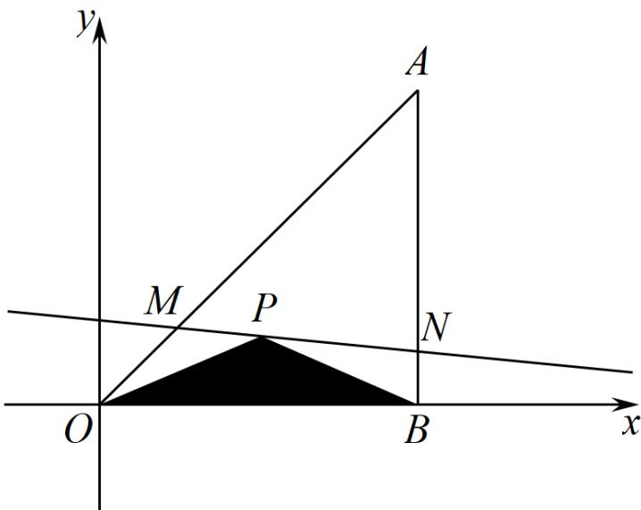

<!-- question-source:start -->
12．如图所示，将一块直角三角形板 ABO 置于平面直角坐标系中，已知 $AB = BO = 1$ ， $AB \perp BO$ ，点

$P\left(\frac{1}{2}, \frac{1}{4}\right)$ 是三角板内一点，现因三角板中阴影部分受到损坏，要把损坏部分锯掉，可用经过点 $P$ 的任一直线

$MN$ 将三角形 $ABO$ 锯成三角形 $AMN$ ，设直线 $MN$ 的斜率为 $k$ ：

(1)求直线 $MN$ 的方程（用 $k$ 表示）；

(2)求锯成的 $\triangle AMN$ 面积的最小值.
<!-- question-source:end -->

![[高中/课堂同步/题库/人教A版高中数学同步讲义(2026)/03_选择性必修第一册/第二章 直线和圆的方程/专题2.2 直线的方程（高效培优讲义）/强化训练/questions/answers/Q00080599A1.md]]
