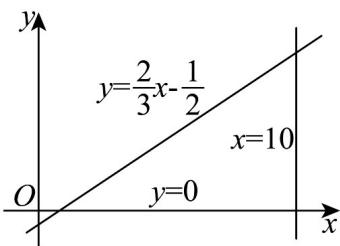

> [!faq]- 《专题2.2 直线的方程（高效培优讲义）》官方解析
>
> > [!success]- **【答案】** C
>
> > [!note]- **【分析】**
> > 做出直线 $y=\frac{2}{3}x-\frac{1}{2}$ 的图像，依据图像进行求解.
>
> > [!note]- **【解析】**
> > 
> >
> > 显然直线 $y = \frac{2}{3} x - \frac{1}{2}$ ，上无整点，
> >
> > 当 $x = 1$ ， $y = \frac{1}{6}$ ，有1个点；
> >
> > 当 $x = 2$ ， $y = \frac{5}{6}$ ，有1个点；
> >
> > 当 $x = 3$ ， $y = \frac{3}{2}$ ，有2个点；
> >
> > 当 $x = 4$ ， $y = \frac{13}{6}$ ，有3个点；
> >
> > 当 x=5， $y=\frac{17}{6}$ ，有3个点；
> >
> > 当 $x = 6$ ， $y = \frac{7}{2}$ ，有4个点；
> >
> > 当 $x = 7$ ， $y = \frac{25}{6}$ ，有5个点；
> >
> > 当 $x = 8$ ， $y = \frac{29}{6}$ ，有5个点；
> >
> > 当 x=9， $y=\frac{11}{2}$ ，有6个点；
> >
> > 当 x=10， $y=\frac{37}{6}$ ，有7个点；
> >
> > 故选 **C**.
