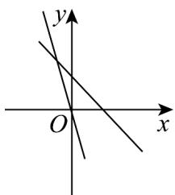

<!-- question-source:start -->
【典例1】一次函数 $l_{2}: y = kx + b$ 与 $l_{1}: y = kbx(k, b$ 为常数，且 $kb \neq 0$ ，它们在同一坐标系内的图象可能为

( )

A

B

C

D

<!-- question-source:end -->

![[高中/课堂同步/题库/人教A版高中数学同步讲义(2026)/03_选择性必修第一册/第二章 直线和圆的方程/专题2.2 直线的方程（高效培优讲义）/题型02_斜截式直线方程/questions/answers/Q00080556A1.md]]
