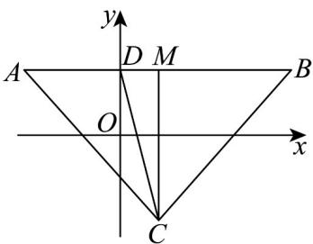

> [!faq]- 《专题2.2 直线的方程（高效培优讲义）》官方解析
>
> > [!success]- **【答案】** D
>
> > [!note]- **【分析】**
> > 先判断 $f(x)$ 的图象关于直线 x=1 对称，可得 $\left|CA\right|=\left|CB\right|$ ，设 $D(x_{0},2)$ ，根据 $L_{2}=L_{1}+2$ 求出 $D(0,2)$
> >
> > 从而可得答案·
>
> > [!note]- **【解析】**
> > 因为 $f(2 - x) = (2 - x)^2 - 2(2 - x) + \ln |(2 - x) - 1| = x^2 - 2x + \ln |x - 1| = f(x)$ 所以 $f(x)$ 的图象关于直线 $x = 1$ 对称，故 $\left|CA\right| = CB$ . 因为 $y = x^2 - 2x, y = \ln |x - 1|$ 在 $(1, +\infty)$ 都单调递增，在 $(- \infty, 1)$ 都单调递减 $f(x)$ 在 $(1, +\infty)$ 单调递增； $f(x)$ 在 $(- \infty, 1)$ 单调递减. 所以直线 $y = 2$ 与 $y = f(x)$ 的图象只有两个交点 $A(x_1, 2)$ 和点 $B(x_2, 2)(x_1 < x_2)$ ，
> >
> > 设 $D(x_0,2)$ ，则 $L_{1} = |CA| + |CD| + |AD|, L_{2} = |CB| + |CD| + |BD|$
> >
> > 设直线 y = 2 与 x = 1 交点为 M ，
> >
> > 所以 $L_{2} - L_{1} = 2 = |BD| - |AD| = 2|DM| = 2(1 - x_{0})$
> >
> > 则 $x_0 = 0$ ，即 $D(0,2)$
> >
> > 因为直线 $l:y = kx + b$ 经过点 $C(1, - 2)$ ， $D(0,2)$
> >
> > 所以 $k=\frac{2-(-2)}{0-1}=-4$
> >
> > 
> >
> > 故选：D
> >
> > ## 方法技巧
> >
> > 求直线的方程的关键是选择适当的直线方程的形式.
