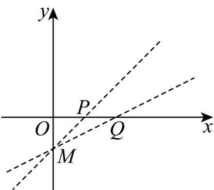

> [!faq]- 《专题2.2 直线的方程（高效培优讲义）》官方解析
>
> > [!success]- **【答案】** C
>
> > [!note]- **【分析】**
> > 根据直线过定点以及两点间斜率公式计算可得结果·
>
> > [!note]- **【解析】**
> > 易知直线 $l: ax + y + 1 = 0$ 过定点 $M(0, -1)$ ，如下图所示：
> >
> > 
> >
> > 易知当直线 l 与线段 PQ 相交时，直线 l 需处在直线 MQ 与直线 MP 之间；
> >
> > 且 $k_{MQ} = \frac{0 + 1}{2 - 0} = \frac{1}{2}$ ， $k_{MP} = \frac{0 + 1}{1 - 0} = 1$
> >
> > 又易知 $ax + y + 1 = 0$ 可化为 y = -ax - 1 ，其斜率为 -a ，
> >
> > 因此可得 $\frac{1}{2} \leq -a \leq 1$ ，解得 $-1 \leq a \leq -\frac{1}{2}$ .
> >
> > 即 $a$ 的取值范围是 $\left[-1, -\frac{1}{2}\right]$
> >
> > 故选 **C**
