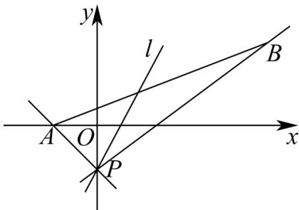

> [!faq]- 《专题2.2 直线的方程（高效培优讲义）》官方解析
>
> > [!success]- **【答案】** A
>
> > [!note]- **【分析】**
> > 求出直线 l 所过定点 P 的坐标，数形结合求出直线 l 的斜率的取值范围.
>
> > [!note]- **【解析】**
> > 直线 $l$ 的方程化为 $m(x + y + 1) + (2x - y - 1) = 0$ ，由 $\left\{ \begin{array}{ll}x + y + 1 = 0 & x = 0\\ 2x - y - 1 = 0 & y = -1 \end{array} \right.$ ，解得
> >
> > 因此直线 $l$ 过定点 $P(0, - 1)$ ，线 $PA$ 的斜率 $k_{PA} = \frac{-1 - 0}{0 + 1} = -1$
> >
> > 直线 $_{PB}$ 的斜率 $k_{PB} = \frac{-1 - 2}{0 - 4} = \frac{3}{4}$
> >
> > 如下图所示，由直线 $l$ 与线段 $AB$ 总有公共点，得直线 $l$ 的斜率 $k$ 有 $k \leq -1$ 或 $k = \frac{3}{4}$ ，
> >
> > 
> >
> > 又直线 $l:(m + 2)x + (m - 1)y + m - 1 = 0$ 的斜率 $k = -\frac{m + 2}{m - 1} = -1 - \frac{3}{m - 1}\neq -1$ 所以直线 $l$ 的斜率的范围为 $\left(-\infty , - 1\right)\cup \left[\frac{3}{4}, + \infty\right).$
> >
> > 故选 **A**
