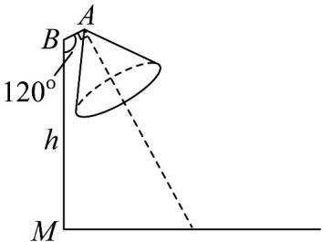

<!-- question-source:start -->
【典例1】如图，在路边安装路灯，路宽 $14\mathrm{m}$ ，在路边的点 $M$ 处立有一根高为 $h$ 灯柱 $MB$ ，灯杆 $AB$ 长 $1\mathrm{m}$ ，

且与灯柱 $MB$ 成 $120^{\circ}$ .路灯采用锥形灯罩（灯罩顶点在点A处），灯罩轴线与灯杆垂直．当灯柱高 $h$ 约多少时，

灯罩轴线正好与道路路面的中线相交？（精确到 $0.01\mathrm{m}$ ，其中 $\sqrt{3} \approx 1.732$ ）

<!-- question-source:end -->

![[高中/课堂同步/题库/人教A版高中数学同步讲义(2026)/03_选择性必修第一册/第二章 直线和圆的方程/专题2.2 直线的方程（高效培优讲义）/题型10_直线方程的实际应用/questions/answers/Q00080588A1.md]]
